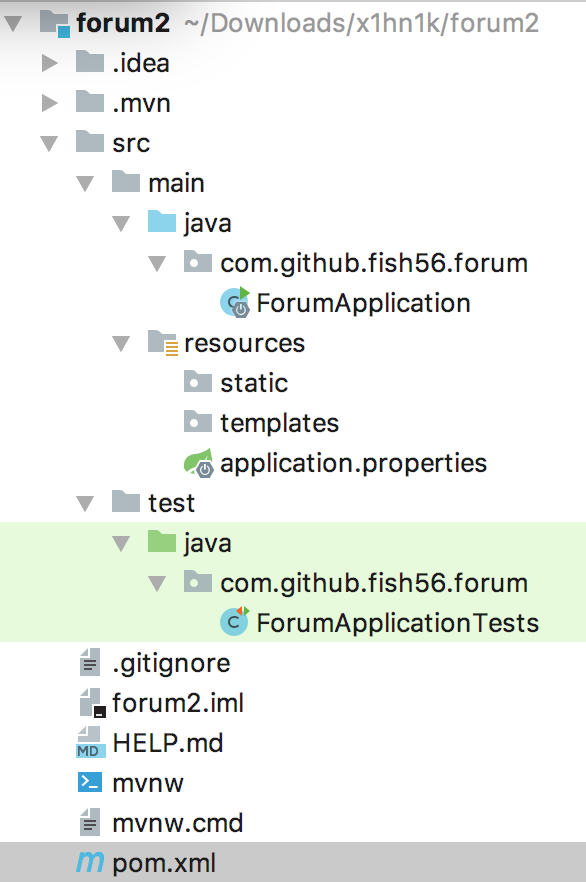

首先使用Spring Initializr 初始化我们的环境。不管你是使用命令程序还是网页版，或者是IDEA中的集成，反正初始化后我们的项目应该长这样：



```xml
    <modelVersion>4.0.0</modelVersion>
    <parent>
        <groupId>org.springframework.boot</groupId>
        <artifactId>spring-boot-starter-parent</artifactId>
        <version>2.1.5.RELEASE</version>
        <relativePath/> <!-- lookup parent from repository -->
    </parent>
    <groupId>com.github.fish56</groupId>
    <artifactId>forum</artifactId>
    <version>1.0</version>
    <name>forum</name>
    <description>Demo project for Spring Boot</description>

    <properties>
        <java.version>1.8</java.version>
    </properties>

    <dependencies>
        <dependency>
            <groupId>org.springframework.boot</groupId>
            <artifactId>spring-boot-starter-data-jpa</artifactId>
        </dependency>
        <dependency>
            <groupId>org.springframework.boot</groupId>
            <artifactId>spring-boot-starter-web</artifactId>
        </dependency>

        <dependency>
            <groupId>org.springframework.boot</groupId>
            <artifactId>spring-boot-devtools</artifactId>
            <scope>runtime</scope>
        </dependency>
        <dependency>
            <groupId>com.h2database</groupId>
            <artifactId>h2</artifactId>
            <scope>runtime</scope>
        </dependency>
        <dependency>
            <groupId>mysql</groupId>
            <artifactId>mysql-connector-java</artifactId>
            <scope>runtime</scope>
        </dependency>
        <dependency>
            <groupId>org.projectlombok</groupId>
            <artifactId>lombok</artifactId>
            <optional>true</optional>
        </dependency>
        <dependency>
            <groupId>org.springframework.boot</groupId>
            <artifactId>spring-boot-starter-test</artifactId>
            <scope>test</scope>
        </dependency>
    </dependencies>

    <build>
        <plugins>
            <plugin>
                <groupId>org.springframework.boot</groupId>
                <artifactId>spring-boot-maven-plugin</artifactId>
            </plugin>
        </plugins>
    </build>
```

这里我们使用了内存数据库h2base，它可以在内存中为我们模拟一个数据库，方便我们在开发阶段直接使用而不用配置外部的数据库环境。


后面还有其他依赖，用到时候再说。


然后大家可以看下我的commit记录

```
...
...

commit dd212ceef05a242970dd32e05d0bc81b779d9843
Author: bitfishxyz <bitfishxyz@gmail.com>
Date:   Wed May 29 18:49:13 2019 +0800

    REST 风格的UserController

commit 075e2b4af6ce128a7ab4a7c17613349452366599
Author: bitfishxyz <bitfishxyz@gmail.com>
Date:   Wed May 29 18:40:07 2019 +0800

    编写userRepos,并使用单元测试验证结果

commit 8e1028a2ea8ffc8247513bfafd575cb60be0da37
Author: bitfishxyz <bitfishxyz@gmail.com>
Date:   Wed May 29 18:29:16 2019 +0800

    创建用户实体

commit 51870c1ac3a3f465188e482e9595a509934adb16
Author: bitfishxyz <bitfishxyz@gmail.com>
Date:   Wed May 29 17:46:52 2019 +0800

    使用Spring Initalizr初始化项目的骨架
```

不明确的可以对比下最终的版本