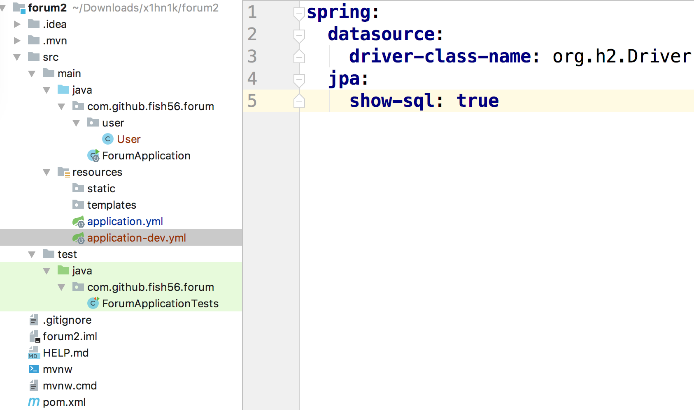

首先呢，我们来写我们的用户模块，

这是一个常见的用户实体类：

```java
import lombok.Data;
import lombok.experimental.Accessors;

/**
 * 用户的实体类
 */
@Data
@Accessors(chain = true)
public class User {
    /**
     * 标识用户的唯一id
     */
    private Integer id;

    /**
     * 用户的姓名，更加自己的业务逻辑，自行决定是否可以重复
     */
    private String name;

    /**
     * 登录是采用邮箱+密码，所以邮箱必须是唯一的
     */
    private String email;

    /**
     * 用户第一次登录需要提供密码，
     *   而后续的请求都是通过token来验证的
     */
    private String token;

    /**
     * 如果允许用户通过第三方登录，那么可以允许密码为空
     */
    private String password;

    /**
     * 用户头像的url
     */
    private String avatar;
}
```

一般来说，用户都有id，有姓名、邮箱。头像的地址

然后这里我使用lombok的@Data给它自动生成了getter 和 setter方法，而@Accessors运行沃恩链式调用

```java
User user = new User().setId(1).setName("Jon")
```


然后我们把它变成实体

```java
import javax.persistence.Entity;
import javax.persistence.GeneratedValue;
import javax.persistence.GenerationType;
import javax.persistence.Id;

@Entity
public class User {
    @Id
    @GeneratedValue(strategy = GenerationType.IDENTITY)
    private Integer id;
  
    ...
}
```

它就能更加表自动的生成数据库结构

Jpa在运行时会扫描被@Entity标注的类，根据合适的规则转化为数据库的表

分析下这两个语句个注解，以及建表语句


编写applyml配置文件，测试文件

```yml
spring:
  profiles:
    active: dev
```




这样的话我们就简单的

```sql
create table user (id integer generated by default as identity, avatar varchar(255), email varchar(255), name varchar(255), password varchar(255), token varchar(255), primary key (id))
```

mysql中不一样的

```sql
create table user (id integer auto——increasement, avatar varchar(255), email varchar(255), name varchar(255), password varchar(255), token varchar(255), primary key (id))
```

```
    /**
     * Indicates that the persistence provider must assign 
     * primary keys for the entity using a database identity column.
     */
    IDENTITY, 
```

所以我们可以在建表的时候选择AUTO，让Jpa帮我们生成id，不过我们这里就是使用mysql，所以我就直接使用了


但是上面的建表语句还是比较粗糙，我们可能要精准的定义一些行为，比如说vachar的长度，不能为null，不能为重复

精确的配置ddl语句

控制这个行为

@Column

```java
package javax.persistence;

@Target({METHOD, FIELD}) 
@Retention(RUNTIME)
public @interface Column {

    /**
     * 对应到数据库列的名称，默认就是实体类的字段名
     *   articleId -> article_id
     */
    String name() default "";

    /**
     * 这一个列是否可以有重复的值
     */
    boolean unique() default false;

    /**
     * 是否允许为null
     */
    boolean nullable() default true;

    /**
     * 自定义的ddl约束
     */
    String columnDefinition() default "";


    /**
     * Java String类型映射到varchar时的长度
     */
    int length() default 255;
}
```


然后我们就可以把它嫩应用到我们的是实体上了

```java
package com.github.fish56.forum.user;

import lombok.Data;
import lombok.experimental.Accessors;

import javax.persistence.*;

/**
 * 用户的实体类
 */
@Data
@Accessors(chain = true)
@Entity
public class User {
    /**
     * 标识用户的唯一id
     */
    @Id
    @GeneratedValue(strategy = GenerationType.IDENTITY)
    private Integer id;

    /**
     * 用户的姓名，更加自己的业务逻辑，自行决定是否可以重复
     */
    @Column(nullable = false, length = 20)
    private String name;

    /**
     * 登录是采用邮箱+密码，所以邮箱必须是唯一的
     */
    @Column(length = 30, unique = true, nullable = false)
    private String email;

    /**
     * 用户第一次登录需要提供密码，
     *   而后续的请求都是通过token来验证的
     */
    @Column(unique = true, nullable = false)
    private String token;

    /**
     * 如果允许用户通过第三方登录，那么可以允许密码为空
     */
    @Column(nullable = false, length = 30)
    private String password;

    /**
     * 用户头像的url
     */
    @Column(length = 200)
    private String avatar;
}
```


然后大家自行启动下程序，看看建表语句是不是这样的

```sql
create table user (id integer generated by default as identity, avatar varchar(200), email varchar(30) not null, name varchar(20) not null, password varchar(30) not null, token varchar(255) not null, primary key (id))

```

