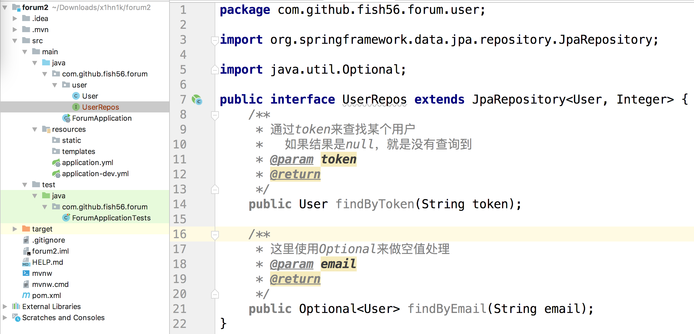

分析下几种接口

然后我们说Jpa另一个核心特色就是更加方法名自动的生成响应的数据库查询方法

findAll 就会解析从  select  ..  from user   

它的原理简单涞就是利用发射技术拿到方法名，然后对方法名做一个词法分析，解析出对应的sql语句，然后生成一个代理类


1. 都要继承@Reposiry这个接口

每个方法都有单个不封组层的， 方法名，参数，返回值的包装


然后三个继承的层级，就是帮我嗯呢提前写好一些方法

我们实际应用中一搬直接继承JpaRepository,功能更加强大，如果有的用不到的话不用就是了




```java
public interface UserRepos extends JpaRepository<User, Integer> {
    /**
     * 通过token来查找某个用户
     *   如果结果是null，就是没有查询到
     * @param token
     * @return
     */
    public User findByToken(String token);

    /**
     * 这里使用Optional来做空值处理
     * @param email
     * @return
     */
    public Optional<User> findByEmail(String email);
}
```

然后我们返回值可以是User 也可以是Option 其实Jpa会更加返回值自动的包装为合适的类型，前者使用null值没有草找到，后者用户optional，用哪个都行，看自己的习惯。


然后编写我们的单元测试

首先要想数据库中首先要注入一些数据，这里我们就简单的写一点

```sql
insert into user (email, name, password, token)
values ('hello@gmail.com', 'Jon', '1234567890', 'hello_token');
```


这个是h2base的特性，它在启动时会读取根classpat:schame.sql 以及classpath：data.sql中的数据

这里我们就插入这个数据库，后续所有的有依赖与这个数据。然后下面三个是欧文以后要用到的，暂时先让他们处于注释状态，

我们也不用写建表语句，应为这是jpa自动生成的

```java
@RunWith(SpringRunner.class)
@SpringBootTest
@AutoConfigureMockMvc
public class ForumApplicationTests {
    protected static String token = "hello_token";
    protected static String email = "hello@gmail.com";

    @Autowired
    protected MockMvc mockMvc;

    @Test
    public void contextLoads() {
    }

}
```


```java
public class UserReposTest extends ForumApplicationTests {

    @Autowired
    private UserRepos userRepos;

    @Test
    public void findByToken(){
        User user = userRepos.findByToken(token);
        System.out.println(user);
    }

    @Test
    public void findByEmail(){
        Optional<User> userOptional = userRepos.findByEmail(email);
        System.out.println(userOptional.get());
    }
}
```


可以看到我们确实成功了，两个方法都能查询到数据。

