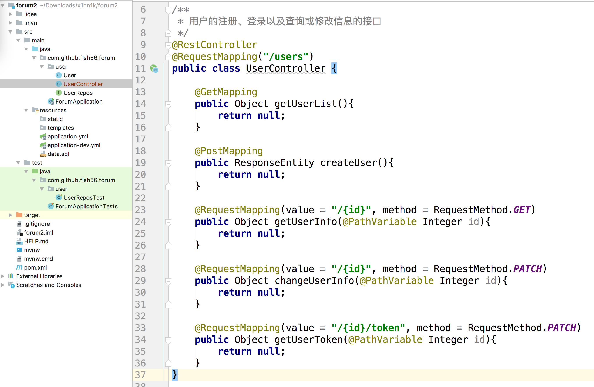
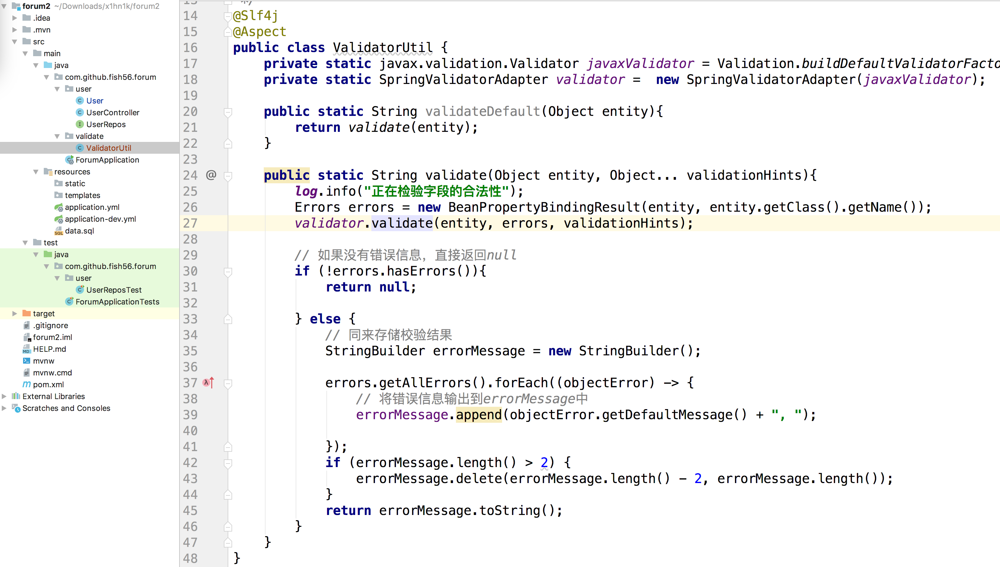
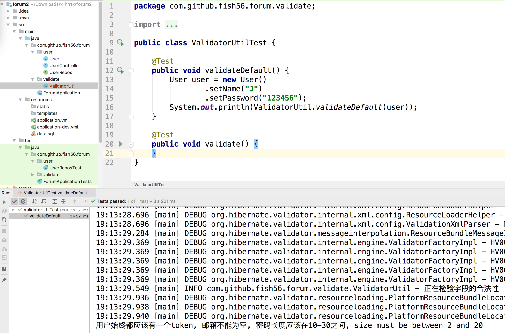
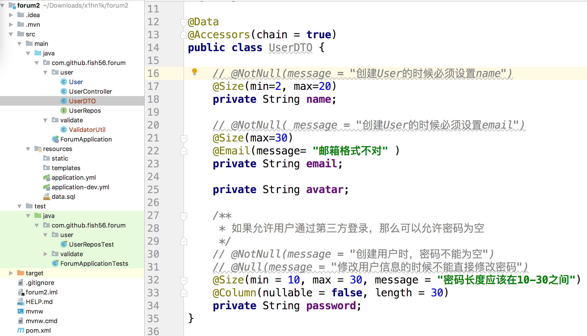
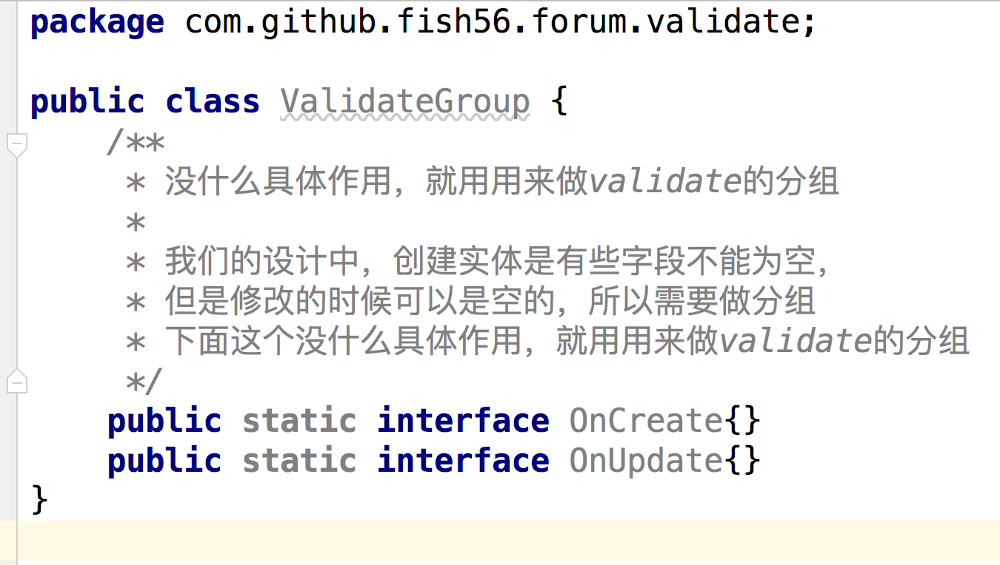
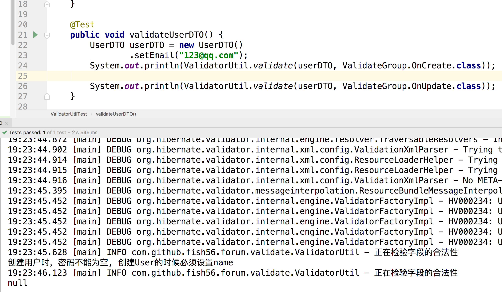

## User模块的REST 风格的路由

在REST风格中，我们的的url应该用来表示资源的位置，用HTTP方法来表示我们的行为。

- 比如 /users 表明我们的资源位置

- 获得用户列表就是 GET /users,
- 创建用户就是发起POST /users

- 查询用户就是GET /users/{id} 

- 修改用户信息PATCH方法

反正大概就是下面这样的(完全模仿GitHub的API设计)




```java
@RestController
@RequestMapping("/users")
public class UserController {

    @GetMapping
    public Object getUserList(){
        return null;
    }

    @PostMapping
    public ResponseEntity createUser(){
        return null;
    }

    @RequestMapping(value = "/{id}", method = RequestMethod.GET)
    public Object getUserInfo(@PathVariable Integer id){
        return null;
    }

    @RequestMapping(value = "/{id}", method = RequestMethod.PATCH)
    public Object changeUserInfo(@PathVariable Integer id){
        return null;
    }

    @RequestMapping(value = "/{id}/token", method = RequestMethod.PATCH)
    public Object getUserToken(@PathVariable Integer id){
        return null;
    }
}
```

注意一点就是，我们认为用户的token是一个敏感的数据，所以在修改用户信息的时候不能修改token。如果想要更新token，我们单独写了一个路由，到时候做一个安全度比较高的检验。


但是在继续写我们的Controller层之前，我们有两个问题：

- 当客户端尝试创建用户的时候，会传递一些数据，我们需要对这些数据做一个检验，看看是否为空，长度是否合理
- 需要有一个UserDTO来承载用户上传的数据

接下来我们就来解决这个问题。

不过提前说一下，这里很多技术都是属于手艺活，大家能复制黏贴，看得懂怎么用的就行了。没必要思考为什么这样写，我也没必要引导是教学。就是我写一遍，大家能熟练的使用就行了。


参数校验本质上是什么呢?其实是应为我们的类型系统不足以描述我们的数据特征

比如eamil，我们一般使用字符串来存储，但是我们知道email一般要满足xxx@xx.xx的格式，Java中的String类型无法描述这个信息，所以我们需要额外的扩展。具体就是Java有一套规范来帮我们完善这一点


当我们在引入spring-data-jpa-starter 后，javax.validation这个包也会被映入，这个包里有下面的注解

- @NotNull(message = "姓名不能为空")

  不能为null。如果不符合规则，报出 "姓名不能为空" 这个信息

- @Size(min=2, max=20)

  字符串的长度应该在2-20之间

- @Email(message= "邮箱格式不对")

  必须是电子邮箱的格式

具体的用法如下

```java
package com.github.fish56.forum.user;

import lombok.Data;
import lombok.experimental.Accessors;

import javax.persistence.*;
import javax.validation.constraints.Email;
import javax.validation.constraints.NotNull;
import javax.validation.constraints.Size;

/**
 * 用户的实体类
 */
@Data
@Accessors(chain = true)
@Entity
public class User {
    /**
     * 标识用户的唯一id
     */
    @Id
    @GeneratedValue(strategy = GenerationType.IDENTITY)
    private Integer id;

    /**
     * 用户的姓名，更加自己的业务逻辑，自行决定是否可以重复
     */
    @NotNull(message = "姓名不能为空")
    @Size(min=2, max=20)
    @Column(nullable = false, length = 20)
    private String name;

    /**
     * 登录是采用邮箱+密码，所以邮箱必须是唯一的
     */
    @NotNull(message = "邮箱不能为空")
    @Size(max=30)
    @Email(message= "邮箱格式不对")
    @Column(length = 30, unique = true, nullable = false)
    private String email;

    /**
     * 用户第一次登录需要提供密码，
     *   而后续的请求都是通过token来验证的
     */
    @NotNull(message = "用户始终都应该有一个token")
    @Column(unique = true, nullable = false)
    private String token;

    /**
     * 如果允许用户通过第三方登录，那么可以允许密码为空
     */
    @NotNull(message = "密码不能为空")
    @Size(min = 10, max = 30, message = "密码长度应该在10-30之间")
    @Column(nullable = false, length = 30)
    private String password;

    /**
     * 用户头像的url
     */
    @Column(length = 200)
    private String avatar;
}


```

好了，常用的注解介绍完了，我们如何使用呢?

很多写法就是样板代码，没有为什么，就是这样的写的属于手艺活，大家跟着我模仿就是行了。

- 创建一个validate对象

  ```java
  private static javax.validation.Validator javaxValidator = Validation.buildDefaultValidatorFactory().getValidator();
      private static SpringValidatorAdapter validator =  new SpringValidatorAdapter(javaxValidator);
  ```

  具体的写法就是这样的

- 然后这个validator有个validate方法

  ```java
public void validate(Object target, Errors errors, Object... validationHints)
  ```
  
  就收三个参数
  
  - 需要被校验的实体
  
    也是就是我们的user对象
  
  - 同来接受异常信息的Errors对象
  
    原生了validate方法会把检验中的错误信息放在这个对象中，但是一来来说我们可能只需要一个字符串来记录错误信息，所以等会处理的时候我们会把这个errors对象转化为一个字符串
  
  - 可选的，分组信息
  
    因为在不同的场景下，我们的校验规则可能不同，我们可能写写出形如
  
    ```java
    @NotNull(groups = ValidateGroup.OnCreate.class, message = "创建User的时候必须设置name")
    ```
  
    的代码，上述校验规则自在特定的分组下才生效

```java
    @Test
    public void validate() {
        User user = new User()
                .setName("J")
                .setPassword("123456");
        Validator javaxValidator = Validation.buildDefaultValidatorFactory().getValidator();
        SpringValidatorAdapter validator =  new SpringValidatorAdapter(javaxValidator);

        Errors errors = new BeanPropertyBindingResult(user, user.getClass().getName());

        validator.validate(user, errors);

        // 同来存储校验结果
        StringBuilder errorMessage = new StringBuilder();

        errors.getAllErrors().forEach((objectError) -> {
            // 将错误信息输出到errorMessage中
            errorMessage.append(objectError.getDefaultMessage() + ", ");

        });
        if (errorMessage.length() > 2) {
            errorMessage.delete(errorMessage.length() - 2, errorMessage.length());
        }
        System.out.println(errorMessage.toString());

    }
```

这就是他的基本用法，我们的user缺少name，会爆出name

```
size must be between 2 and 20, 用户始终都应该有一个token, 邮箱不能为空, 密码长度应该在10-30之间
```


然后我们可以把它写出一个util函数来

然后我写的util函数如下

```java
/**
 * 手动检验字段的合法性
 */
@Slf4j
public class ValidatorUtil {
    private static javax.validation.Validator javaxValidator = Validation.buildDefaultValidatorFactory().getValidator();
    private static SpringValidatorAdapter validator =  new SpringValidatorAdapter(javaxValidator);

    public static String validateDefault(Object entity){
        return validate(entity);
    }

    public static String validate(Object entity, Object... validationHints){
        log.info("正在检验字段的合法性");
        Errors errors = new BeanPropertyBindingResult(entity, entity.getClass().getName());
        validator.validate(entity, errors, validationHints);

        // 如果没有错误信息，直接返回null
        if (!errors.hasErrors()){
            return null;

        } else {
            // 同来存储校验结果
            StringBuilder errorMessage = new StringBuilder();

            errors.getAllErrors().forEach((objectError) -> {
                // 将错误信息输出到errorMessage中
                errorMessage.append(objectError.getDefaultMessage() + ", ");

            });
            if (errorMessage.length() > 2) {
                errorMessage.delete(errorMessage.length() - 2, errorMessage.length());
            }
            return errorMessage.toString();
        }
    }
}
```




虽然代码多了不少，但是核心逻辑没有变化，就是validate做检验

然后这里validationHint就是我们的group


接下我们编写个测试用来


```java
    @Test
    public void validateDefault() {
        User user = new User()
                .setName("J")
                .setPassword("123456");
        System.out.println(ValidatorUtil.validateDefault(user));
    }
```

然后我们编写一个 测试文件



点击运行，我们可以发现确实把我们的错误给找出来了


然后我们编写沃恩的数据传输对象，用户要上传的数据，我们就用这个对象来承载,客户端创建用户的时候

需要传递 name， email，avatar， password



```java
@Data
@Accessors(chain = true)
public class UserDTO {

    // @NotNull(message = "创建User的时候必须设置name")
    @Size(min=2, max=20)
    private String name;

    // @NotNull( message = "创建User的时候必须设置email")
    @Size(max=30)
    @Email(message= "邮箱格式不对" )
    private String email;

    private String avatar;

    /**
     * 如果允许用户通过第三方登录，那么可以允许密码为空
     */
    // @NotNull(message = "创建用户时，密码不能为空")
    // @Null(message = "修改用户信息的时候不能直接修改密码")
    @Size(min = 10, max = 30, message = "密码长度应该在10-30之间")
    @Column(nullable = false, length = 30)
    private String password;
}
```


但是大家有没有注意我又一些注释?主要是有这样的需求

- 创建用户的时候email不能为空
- 修改的时候可以

所以在是否可以为null这个问题上，不同的场景有不同的需求，那我们怎么解决?

支持分组！！


```java
public class ValidateGroup {
    /**
     * 没什么具体作用，就用用来做validate的分组
     *
     * 我们的设计中，创建实体是有些字段不能为空，
     * 但是修改的时候可以是空的，所以需要做分组
     * 下面这个没什么具体作用，就用用来做validate的分组
     */
    public static interface OnCreate{}
    public static interface OnUpdate{}
}

```



```java
package com.github.fish56.forum.validate;

import javax.validation.groups.Default;

public class ValidateGroup {
    /**
     * 没什么具体作用，就用用来做validate的分组
     *
     * 我们的设计中，创建实体是有些字段不能为空，
     * 但是修改的时候可以是空的，所以需要做分组
     * 下面这个没什么具体作用，就用用来做validate的分组
     */
    public static interface OnCreate extends Default {}
    public static interface OnUpdate extends Default {}
}
```

这个我在commit记录记录中忘了加，注意下

为什么


```java
@Data
@Accessors(chain = true)
public class UserDTO {

    @NotNull(groups = ValidateGroup.OnCreate.class, message = "创建User的时候必须设置name")
    @Size(min=2, max=20)
    private String name;

    @NotNull(groups = ValidateGroup.OnCreate.class, message = "创建User的时候必须设置email")
    @Size(max=30)
    @Email(message= "邮箱格式不对" )
    private String email;

    private String avatar;

    /**
     * 如果允许用户通过第三方登录，那么可以允许密码为空
     */
    @NotNull(groups = ValidateGroup.OnCreate.class, message = "创建用户时，密码不能为空")
    @Null(groups = ValidateGroup.OnUpdate.class, message = "修改用户信息的时候不能直接修改密码")
    @Size(min = 10, max = 30, message = "密码长度应该在10-30之间")
    @Column(nullable = false, length = 30)
    private String password;
}
```


这是测试代码

```java
    @Test
    public void validateUserDTO() {
        UserDTO userDTO = new UserDTO()
                .setEmail("123@qq.com");
        System.out.println(ValidatorUtil.validate(userDTO, ValidateGroup.OnCreate.class));

        System.out.println(ValidatorUtil.validate(userDTO, ValidateGroup.OnUpdate.class));
    }
```

这是测试结果



然后我们在编写测试用例可以发现，前者有错误信息，后者没有，正是分组发挥了作用，