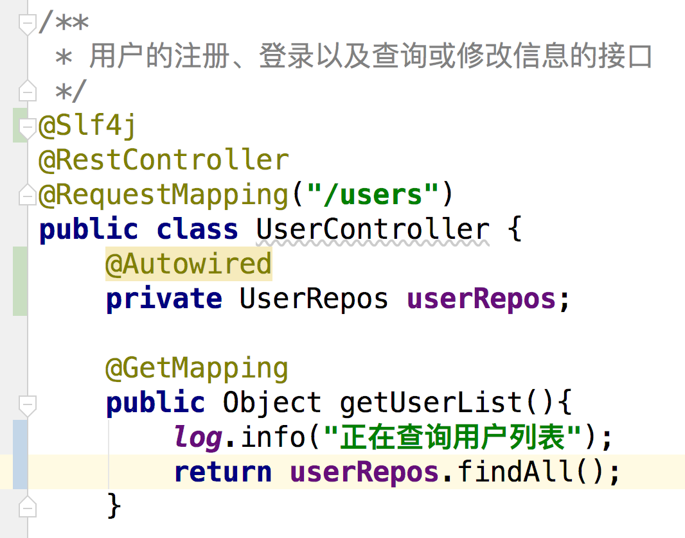
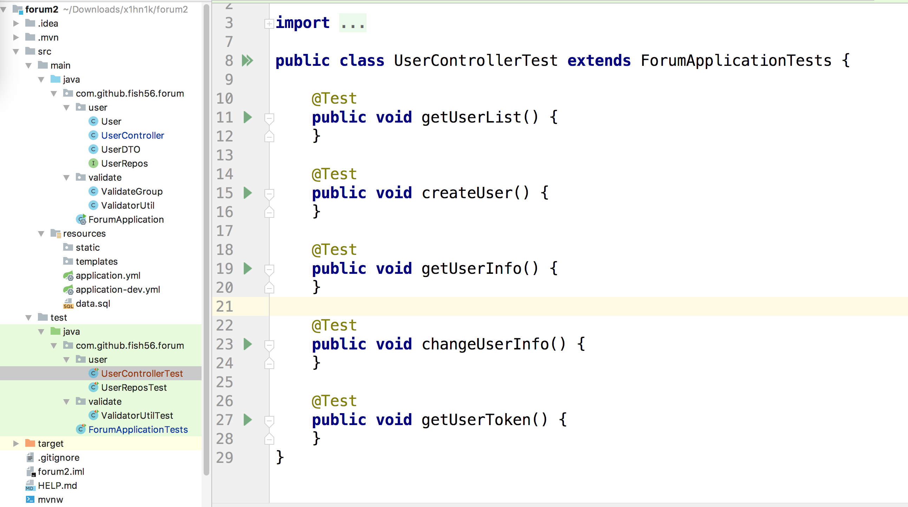
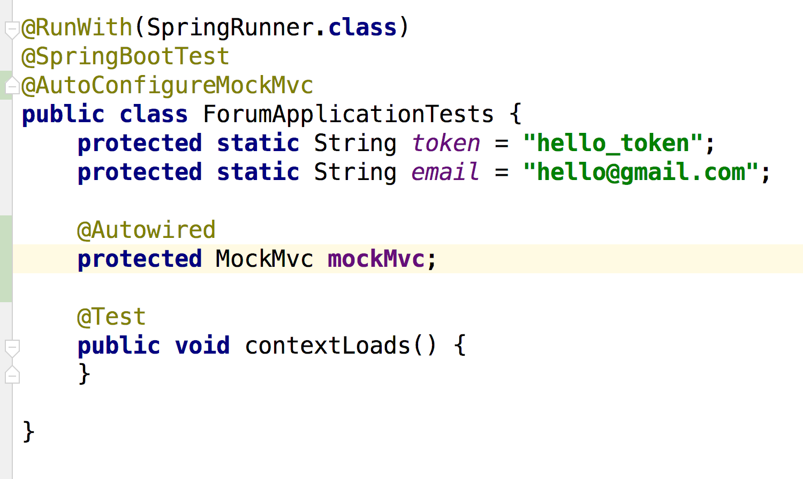
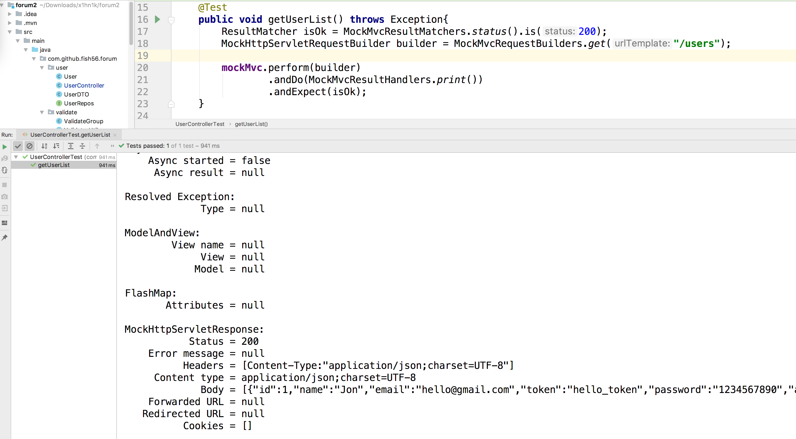

回过头来，编写我们的Controler层

首先就是查询用户信息的接口



```java
    @Autowired
    private UserRepos userRepos;

    @GetMapping
    public Object getUserList(){
        log.info("正在查询用户列表");
        return userRepos.findAll();
    }
```

这个就是很常见的，获得用户列表

然后返回值Iterable对象，他会被SpringMvc序列化成一个JSON数组，返回给客户端，


然后我们来单元测试的逻辑

首先是我们的




但是接下来怎么写呢，其实我们就要在测试代码中模仿HTTP请求来写

基本写法大概是长这样的

```java

    @Test
    public void getUserList() throws Exception{
        ResultMatcher isOk = MockMvcResultMatchers.status().is(200);
        MockHttpServletRequestBuilder builder = MockMvcRequestBuilders.get("/users");

        mockMvc.perform(builder)
                .andDo(MockMvcResultHandlers.print())
                .andExpect(isOk);
    }

```


- mockMvc,模拟出来的客户端

- 它可以发起一个请求perform方法

- 基于http斑纹，那这个请求报文怎么写呢？

  大致我上线的写法，构造出一个builder对象

  这个对象可以get(url) 向这个路由发起get请求

- 模拟发出请求后，我们会收到响应报文，如何解析呢？

  - 可以打印出来andDo(MockMvcResultHandlers.print())
  - 验证响应报文是否符合某种规则。。。

大家可以善于利用IDE的智能提醒，其他用法可以猜到

一些细节用法可以参考我另外的一个项目，，，


然后还有还有连个问题

- mockMvc哪里来
- 如何配置基本的数据库类完成测试


参考下面的写法




@AutoConfigerMockMvc 添加注解

自动@Autoweird，注意我们把它写到了根测试用例，并且配置了protest权限，这样后去的测试就可以直接通过继承的方式拿到了


另外呢




```java
import com.github.fish56.forum.ForumApplicationTests;
import org.junit.Test;
import org.springframework.test.web.servlet.ResultMatcher;
import org.springframework.test.web.servlet.request.MockHttpServletRequestBuilder;
import org.springframework.test.web.servlet.request.MockMvcRequestBuilders;
import org.springframework.test.web.servlet.result.MockMvcResultHandlers;
import org.springframework.test.web.servlet.result.MockMvcResultMatchers;

import static org.junit.Assert.*;

public class UserControllerTest extends ForumApplicationTests {

    @Test
    public void getUserList() throws Exception{
        ResultMatcher isOk = MockMvcResultMatchers.status().is(200);
        MockHttpServletRequestBuilder builder = MockMvcRequestBuilders.get("/users");

        mockMvc.perform(builder)
                .andDo(MockMvcResultHandlers.print())
                .andExpect(isOk);
    }
}
```


完全模仿htto协议的，发起请求，返回的响应对象，答应出来，是否符合规则。

不用问为什么，就是样板代码和手艺活，多用提高熟练度就行了。


