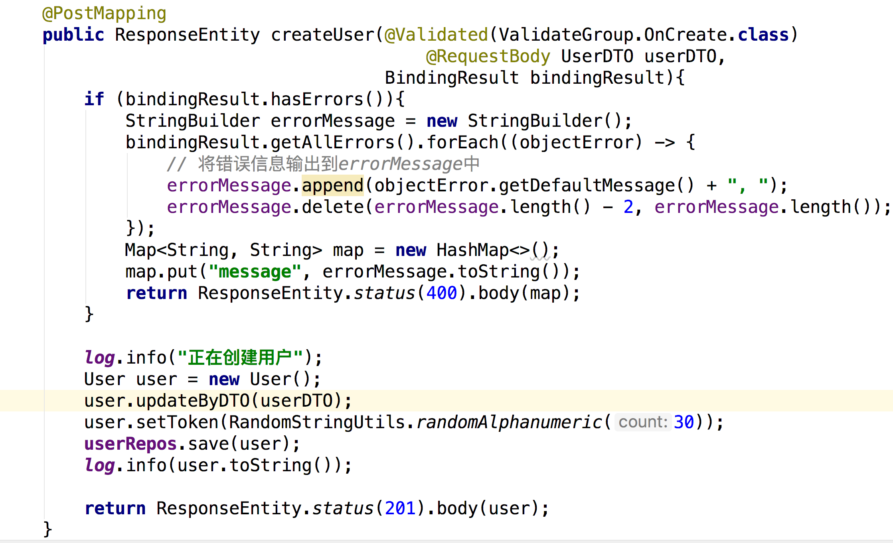
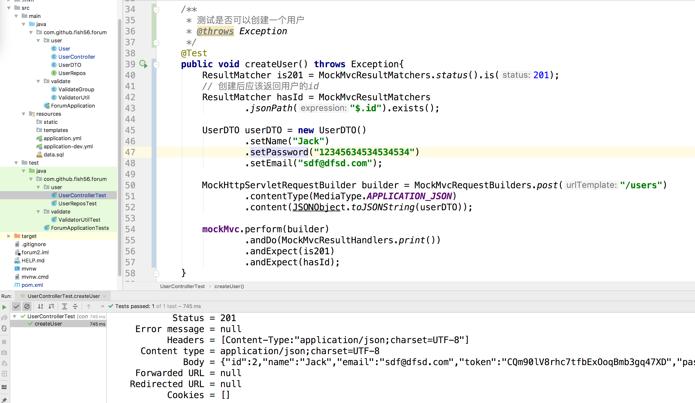
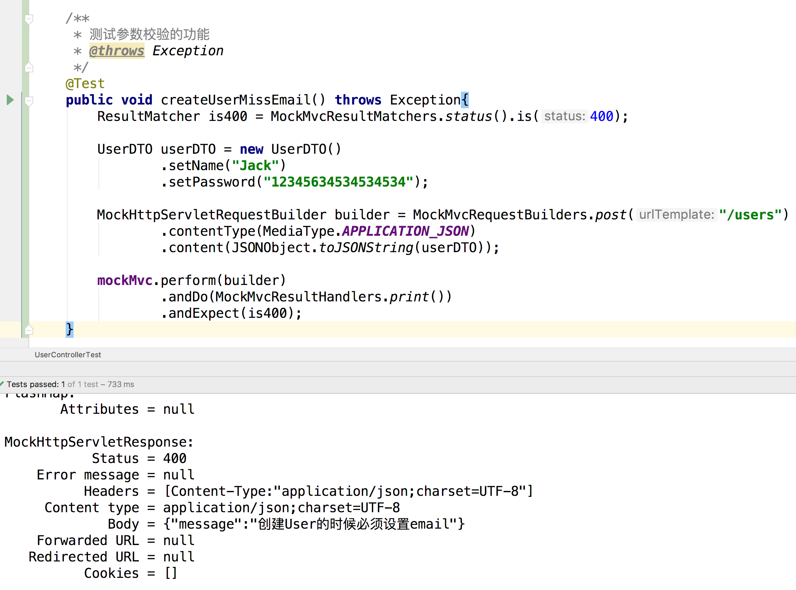
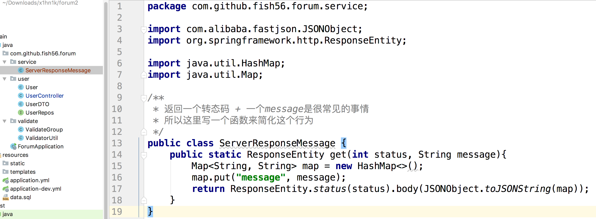
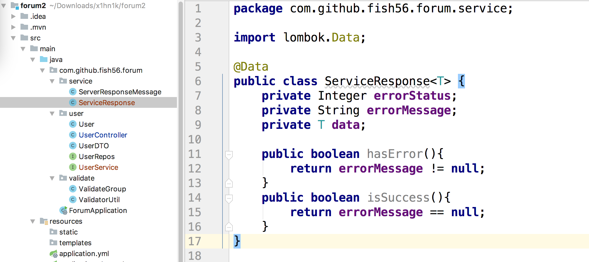
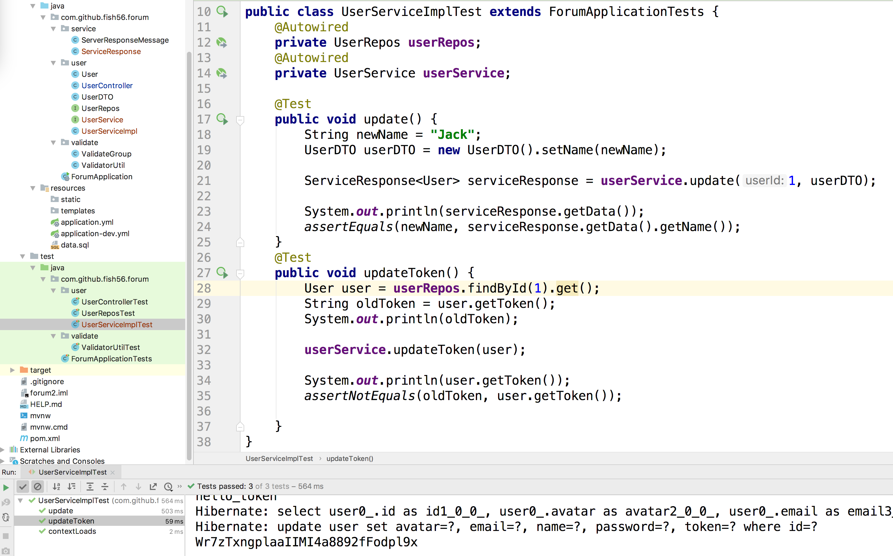
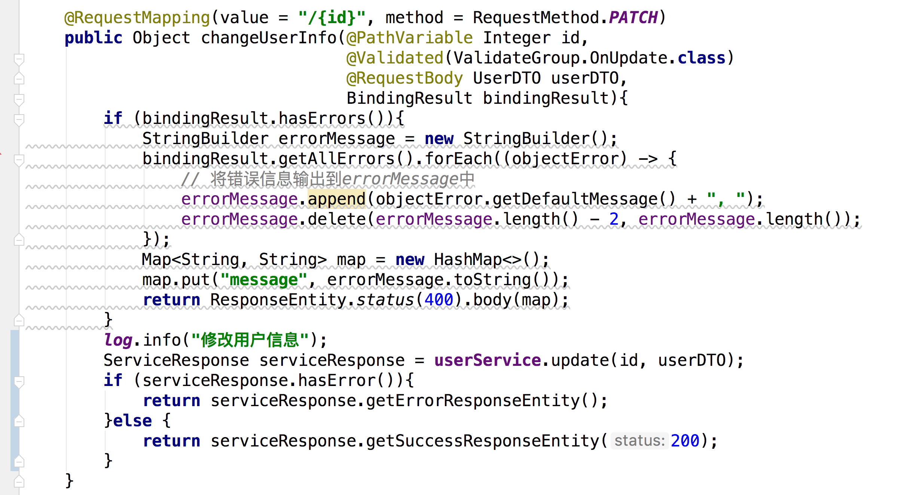
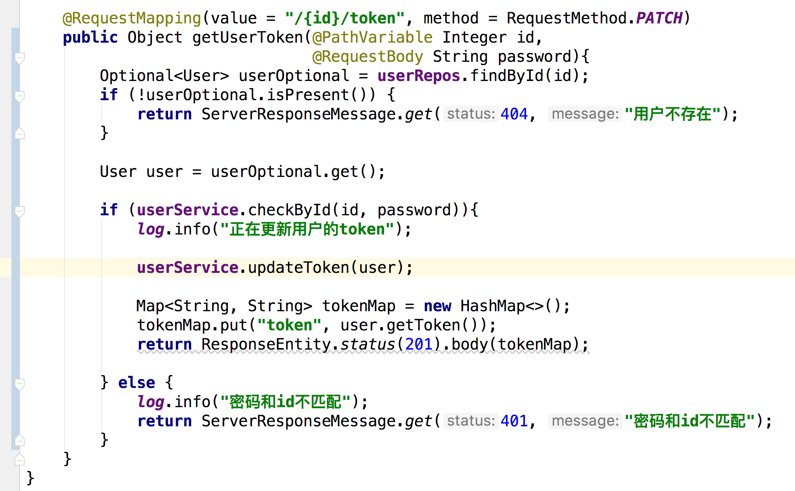
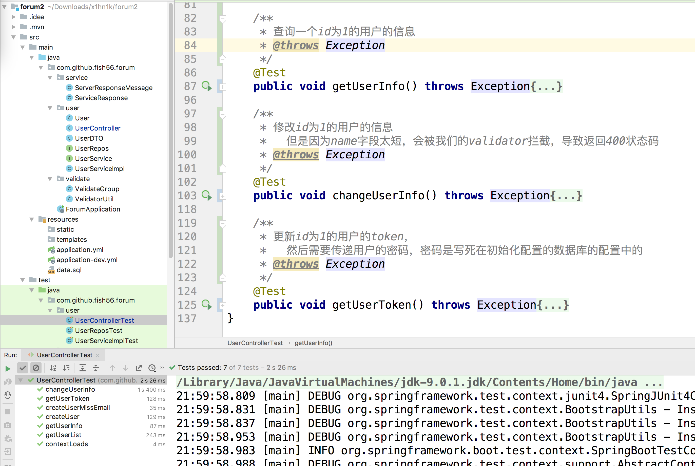

### 创建用户的逻辑


创建用户就要接受用户的输入数据

我们认为

```java
@Data
@Accessors(chain = true)
public class UserDTO {

    @NotNull(groups = ValidateGroup.OnCreate.class, message = "创建User的时候必须设置name")
    @Size(min=2, max=20)
    private String name;

    @NotNull(groups = ValidateGroup.OnCreate.class, message = "创建User的时候必须设置email")
    @Size(max=30)
    @Email(message= "邮箱格式不对" )
    private String email;

    private String avatar;

    /**
     * 如果允许用户通过第三方登录，那么可以允许密码为空
     */
    @NotNull(groups = ValidateGroup.OnCreate.class, message = "创建用户时，密码不能为空")
    @Null(groups = ValidateGroup.OnUpdate.class, message = "修改用户信息的时候不能直接修改密码")
    @Size(min = 10, max = 30, message = "密码长度应该在10-30之间")
    @Column(nullable = false, length = 30)
    private String password;
}
```

然后我们注意到我们的分组规则，

- 客户端创建用户的时候一定要给出name，email，password
- 客户端修改用户的则不需要，上传的数据中有name字段我就修改name，有avtar就修改这个

然后为了方便User和UserDTO的转化，我们可以给User类添加这样的一个类

```java
public class User {
    /**
     * 通过UserVo来修改自身的字段
     * @param userDTO
     */
    public void updateByDTO(UserDTO userDTO){
        if (userDTO.getName() != null) {
            name = userDTO.getName();
        }
        if (userDTO.getEmail() != null) {
            email = userDTO.getEmail();
        }
        if (userDTO.getAvatar() != null) {
            avatar = userDTO.getAvatar();
        }
        if (userDTO.getPassword() != null) {
            password = userDTO.getPassword();
        }
    }
}
```


1. 基本用法
2. 使用Validated标注我们的ResponseBoy,开启我们的参数校验
3. 不是使用javax.valid 是因为这个没有group选项
4. 将Group设置为ValidateGroup.OnCreate.class
5. 用BindingReslut接受这一个

```java
    import org.springframework.validation.annotation.Validated;
    @PostMapping
    public ResponseEntity createUser(@Validated(ValidateGroup.OnCreate.class)
                                         @RequestBody UserDTO userDTO,
                                     BindingResult bindingResult){
        if (bindingResult.hasErrors()){
            StringBuilder errorMessage = new StringBuilder();
            bindingResult.getAllErrors().forEach((objectError) -> {
                // 将错误信息输出到errorMessage中
                errorMessage.append(objectError.getDefaultMessage() + ", ");
                errorMessage.delete(errorMessage.length() - 2, errorMessage.length());
            });
            Map<String, String> map = new HashMap<>();
            map.put("message", errorMessage.toString());
            return ResponseEntity.status(400).body(map);
        }

        return ResponseEntity.status(201).body(null);
    }
```

用时使用validaed做开启校验，用bindresut来接受校验结果


用post方法

用UserDTO来接受客户端传递的数据

```xml
 <dependency>
            <groupId>org.apache.commons</groupId>
            <artifactId>commons-lang3</artifactId>
        </dependency>
```

```java
String token = RandomStringUtils.randomAlphanumeric(30)
```

随机字符串


```java
    @PostMapping
    public ResponseEntity createUser(@Validated(ValidateGroup.OnCreate.class)
                                         @RequestBody UserDTO userDTO,
                                     BindingResult bindingResult){
        if (bindingResult.hasErrors()){
            ...
        }

        log.info("正在创建用户");
        User user = new User();
        user.updateByDTO(userDTO);
        user.setToken(RandomStringUtils.randomAlphanumeric(30));
        userRepos.save(user);
        log.info(user.toString());

        return ResponseEntity.status(201).body(user);
    }
```


最终结果




然后我们来编写测试，用到了一个库，方便序列化一个对象

```
        <dependency>
            <groupId>com.alibaba</groupId>
            <artifactId>fastjson</artifactId>
            <version>1.2.56</version>
        </dependency>
```


```java
    /**
     * 测试是否可以创建一个用户
     * @throws Exception
     */
    @Test
    public void createUser() throws Exception{
        ResultMatcher is201 = MockMvcResultMatchers.status().is(201);
        // 创建后应该返回用户的id
        ResultMatcher hasId = MockMvcResultMatchers
                .jsonPath("$.id").exists();

        UserDTO userDTO = new UserDTO()
                .setName("Jack")
                .setPassword("12345634534534534")
                .setEmail("sdf@dfsd.com");

        MockHttpServletRequestBuilder builder = MockMvcRequestBuilders.post("/users")
                .contentType(MediaType.APPLICATION_JSON)
                .content(JSONObject.toJSONString(userDTO));

        mockMvc.perform(builder)
                .andDo(MockMvcResultHandlers.print())
                .andExpect(is201)
                .andExpect(hasId);
    }
```





```java
    /**
     * 测试参数校验的功能
     * @throws Exception
     */
    @Test
    public void createUserMissEmail() throws Exception{
        ResultMatcher is400 = MockMvcResultMatchers.status().is(400);

        UserDTO userDTO = new UserDTO()
                .setName("Jack")
                .setPassword("12345634534534534");

        MockHttpServletRequestBuilder builder = MockMvcRequestBuilders.post("/users")
                .contentType(MediaType.APPLICATION_JSON)
                .content(JSONObject.toJSONString(userDTO));

        mockMvc.perform(builder)
                .andDo(MockMvcResultHandlers.print())
                .andExpect(is400);
    }
```

在返回值上看到id就说明我们成功了

如果你想在pomst上测试也行，我这里就不演示了





我们没有email，创建失败


然后我们看到我们之前这个代码

```java
Map<String, String> map = new HashMap<>();
            map.put("message", errorMessage.toString());
            return ResponseEntity.status(400).body(map);
```

很常见的，但是写起来太麻烦了，其实变化的不封就是两点：状态吗和消息，所以我们可以总结出一个函数


```
/**
 * 返回一个转态码 + 一个message是很常见的事情
 * 所以这里写一个函数来简化这个行为
 */
public class ServerResponseMessage {
    public static ResponseEntity get(int status, String message){
        Map<String, String> map = new HashMap<>();
        map.put("message", message);
        return ResponseEntity.status(status).body(JSONObject.toJSONString(map));
    }
}
```



然后我们在编写路由

```java
    @RequestMapping(value = "/{id}", method = RequestMethod.GET)
    public Object getUserInfo(@PathVariable Integer id){
        log.info("获取用户信息详情");
        Optional<User> userOptional =  userRepos.findById(id);
        if (userOptional.isPresent()){
            return userOptional.get();
        } else {
            return ServerResponseMessage.get(404, "用户不存在");
        }
    }
```

然后之前的代码我就不改了，主要是留着做对比用的


​       


之前的情况其实是比较简单的，就没有写serivice层，这里还是压写的


但是我们知道，每个函数的返回值是确定的，重视有可能出现各种异常

```java
public interface UserService {
    /**
     * 根据vo的数据更新一个用户
     * @param userId
     * @param userDTO
     * @return
     */
    public User update(Integer userId, UserDTO userDTO);
}
```

这样的问题在于service可能写的很复杂，会有各种异常，怎么处理异常呢?失败返回值抛出异常?这样就是把锅交给了Controler层，会让control变得复杂，返回null，静默失败?不行，意义不明确


所以有个统一挫力异常熟悉的包装类




有错误，把错误形象放在errorMesage上，没有错误的话，就把返回值放在data上，这样我们的

control只要写一个简单的if else就可以知道service层的结果了。


为了方便我们又写了这样的辅助函数

```java
@Data
public class ServiceResponse<T> {
    private Integer errorStatus;
    private String errorMessage;
    private T data;

    public boolean hasError(){
        return errorMessage != null;
    }
    public boolean isSuccess(){
        return errorMessage == null;
    }
    public ResponseEntity getErrorResponseEntity(){
        if (isSuccess()){
            throw new RuntimeException("没有异常信息，无法创建错误报文");
        }
        Map<String, String> map = new HashMap<>();
        map.put("message", errorMessage);
        return ResponseEntity.status(errorStatus).body(map);
    }

    /**
     * 这里并不知道成功的状态吗是多少，需要调用者来决定
     * @param status
     * @return
     */
    public ResponseEntity getSuccessResponseEntity(int status){
        if (hasError()){
            throw new RuntimeException("有异常信息，无法创建成功的响应报文");
        }
        return ResponseEntity.status(status).body(data);
    }

    /**
     * 给个默认值200
     * @return
     */
    public ResponseEntity getSuccessResponseEntity(){
        if (hasError()){
            throw new RuntimeException("有异常信息，无法创建成功的响应报文");
        }
        return ResponseEntity.status(200).body(data);
    }

    public static ServiceResponse getInstance(int errorStatus, String errorMessage){
        ServiceResponse serviceResponse = new ServiceResponse();
        serviceResponse.setErrorStatus(errorStatus);
        serviceResponse.setErrorMessage(errorMessage);
        return serviceResponse;
    }
    public static ServiceResponse getInstance(Object data){
        ServiceResponse serviceResponse = new ServiceResponse();
        serviceResponse.setData(data);
        return serviceResponse;
    }
}
```


一般都是变用到编写，在Controler层先写一会，但是这里我就提前写好了

下面是我们后面需要的service接口

```java
public interface UserService {
    /**
     * 根据vo的数据更新一个用户
     * @param userId
     * @param userDTO
     * @return
     */
    public ServiceResponse<User> update(Integer userId, UserDTO userDTO);

    /**
     * 更新token
     * @param user
     * @return
     */
    public User updateToken(User user);

    /**
     * 判断用户的email和密码是否匹配
     * @param email
     * @param password
     * @return
     */
    public Boolean checkByEmail(String email, String password);

    /**
     * 判断用户的id和密码是否匹配
     * @param id
     * @param password
     * @return
     */
    public Boolean checkById(Integer id, String password);
}

```

其实实现类很简单的，我就直接贴出来了

````java
@Slf4j
@Service
public class UserServiceImpl implements UserService {
    @Autowired
    private UserRepos userRepos;

    @Override
    public ServiceResponse update(Integer userId, UserDTO userDTO) {
        Optional<User> userOptional = userRepos.findById(userId);
        if (!userOptional.isPresent()){
            return ServiceResponse.getInstance(404, "试图修改的用户不存在");
        }

        User user = userOptional.get();
        user.updateByDTO(userDTO);

        // 校验更新后的用户是否符合规则
        String errorMessage = ValidatorUtil.validate(user);
        if (errorMessage != null) {
            return ServiceResponse.getInstance(400, errorMessage);
        }

        userRepos.save(user);

        return ServiceResponse.getInstance(user);
    }

    @Override
    public User updateToken(User user) {
        String token = RandomStringUtils.randomAlphanumeric(30);
        user.setToken(token);
        userRepos.save(user);
        return user;
    }

    @Override
    public Boolean checkByEmail(String email, String password) {
        Optional<User> userOptional = userRepos.findByEmail(email);
        return userOptional.isPresent() && userOptional.get().getPassword().equals(password);
    }
    @Override
    public Boolean checkById(Integer id, String password) {
        Optional<User> userOptional = userRepos.findById(id);
        return userOptional.isPresent() && userOptional.get().getPassword().equals(password);
    }
}
````

记得@Service

然后我们编写演员测试场拿到结果

```java
public class UserServiceImplTest extends ForumApplicationTests {
    @Autowired
    private UserRepos userRepos;
    @Autowired
    private UserService userService;

    @Test
    public void update() {
        String newName = "Jack";
        UserDTO userDTO = new UserDTO().setName(newName);

        ServiceResponse<User> serviceResponse = userService.update(1, userDTO);

        System.out.println(serviceResponse.getData());
        assertEquals(newName, serviceResponse.getData().getName());
    }
    @Test
    public void updateToken() {
        User user = userRepos.findById(1).get();
        String oldToken = user.getToken();
        System.out.println(oldToken);

        userService.updateToken(user);

        System.out.println(user.getToken());
        assertNotEquals(oldToken, user.getToken());

    }
}
```




### 接下来我们写修改用户信息的逻辑，基本盘就是这样的

patch方法

参数校验

ide以及提醒有重复代码了，先别管，后面重点讲的AOP，这里暂时不管它了

然后偶在创建用户的时候，需要创建token，所以我们






```java
    /**
     * 查询一个id为1的用户的信息
     * @throws Exception
     */
    @Test
    public void getUserInfo() throws Exception{
        ResultMatcher isOk = MockMvcResultMatchers.status().is(200);

        MockHttpServletRequestBuilder builder = MockMvcRequestBuilders.get("/users/1");

        mockMvc.perform(builder)
                .andDo(MockMvcResultHandlers.print())
                .andExpect(isOk);
    }

    /**
     * 修改id为1的用户的信息
     *   但是因为name字段太短，会被我们的validator拦截，导致返回400状态码
     * @throws Exception
     */
    @Test
    public void changeUserInfo() throws Exception{
        ResultMatcher is400 = MockMvcResultMatchers.status().is(400);

        User user = new User().setId(1)
                .setName("L")
                .setEmail("sdf@dfsd.com");

        MockHttpServletRequestBuilder builder = MockMvcRequestBuilders.patch("/users/1")
                .contentType(MediaType.APPLICATION_JSON)
                .content(JSONObject.toJSONString(user));

        mockMvc.perform(builder)
                .andDo(MockMvcResultHandlers.print())
                .andExpect(is400);
    }

    /**
     * 更新id为1的用户的token，
     *   然后需要传递用户的密码，密码是写死在初始化配置的数据库的配置中的
     * @throws Exception
     */
    @Test
    public void getUserToken() throws Exception{
        ResultMatcher is201 = MockMvcResultMatchers.status().is(201);

        String password = "1234567890";
        MockHttpServletRequestBuilder builder = MockMvcRequestBuilders.patch("/users/1/token")
                .contentType(MediaType.TEXT_PLAIN)
                .content(password);

        mockMvc.perform(builder)
                .andDo(MockMvcResultHandlers.print())
                .andExpect(is201);
    }
```





