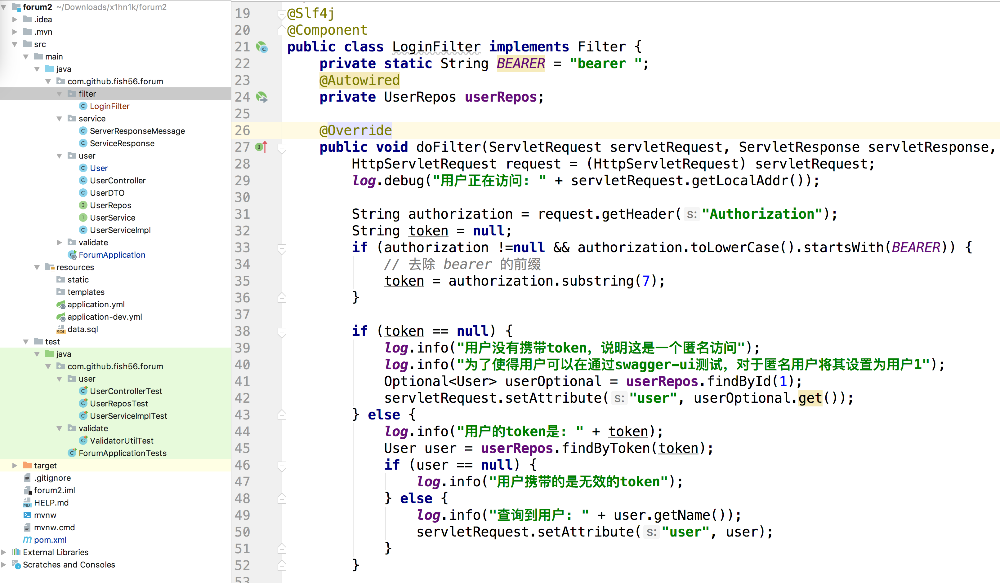

我们的UserController基本完成了，但是还有个问题，那就是password和token的安全问题。
我们之前在获取用户信息的时候，没有对做任何额外的处理，导致我们把用户的密码和token都返回给了客户端，这个肯定是不行的。

我们须要把用户的password和token给隐藏起来。

我们知道，我们在RestController中返回一个Java对象时，SpringMVC底层会调用Jackson把这个对象序列化成JSON字符串。如果我们希望向客户端隐藏这个字段，我们可以给对应的实体类加上
@JsonIgnore这个注解，这样Jackson在序列化的时候，就会忽略这个字段，具体写法如下：

```java
   import com.fasterxml.jackson.annotation.JsonIgnore;
   
   public class User {
   
       。。。
       
       @JsonIgnore
       @NotNull(message = "用户始终都应该有一个token")
       @Column(unique = true, nullable = false)
       private String token;
   
       @JsonIgnore
       @NotNull(message = "密码不能为空")
       @Size(min = 10, max = 30, message = "密码长度应该在10-30之间")
       @Column(nullable = false, length = 30)
       private String password; 
   }
```


然后大家可以测试下查询用户列表的功能，应该可以发现 password 和token这两个字段不见了。

但是注意另一个场景，就是客户端在创建用户的时候，服务器还是要返回token。所以对于下面的路由要特殊处理下：

```java
    @PostMapping
    public ResponseEntity createUser(@Validated(ValidateGroup.OnCreate.class)
                                         @RequestBody UserDTO userDTO,
                                     BindingResult bindingResult){
        ...

        return ResponseEntity.status(201).
                contentType(MediaType.APPLICATION_JSON)
                .body(JSONObject.toJSONString(user));
    }
```
这里为了避免@JsonIgnore的影响，我们使用fastjson的JSONObject.toJSONString(user)手动的序列化我们的user对象，然后把相关的数据返回给客户端。


另一个问题就是我们之前没有做登录认证的功能。只有登录用户才能修改自己的数据，以及后面的发布文章和评论。

但是我们如何处理登录功能呢？
我们这里呢使用token来唯一辨识一个用户，知道用户的请求报文中，写到了token，我们就可以解析出token对应的而用户信息，进而验证请求的身份。

而token放在哪里呢？
一本放在请求头头中
Authorization: bearer you_token
客户端自定防止相关的请求头



```java
package com.github.fish56.forum.filter;

import com.github.fish56.forum.user.User;
import com.github.fish56.forum.user.UserRepos;
import lombok.extern.slf4j.Slf4j;
import org.springframework.beans.factory.annotation.Autowired;
import org.springframework.stereotype.Component;

import javax.servlet.*;
import javax.servlet.http.HttpServletRequest;
import java.io.IOException;
import java.util.Optional;

/**
 * 检查请求头中是否携带了token
 *   如果携带了token，就查询出这个token对应的用户
 *   并将其放置到请求对象中，供下游使用
 */
@Slf4j
@Component
public class LoginFilter implements Filter {
    private static String BEARER = "bearer ";
    @Autowired
    private UserRepos userRepos;

    @Override
    public void doFilter(ServletRequest servletRequest, ServletResponse servletResponse, FilterChain filterChain) throws IOException, ServletException {
        HttpServletRequest request = (HttpServletRequest) servletRequest;
        log.debug("用户正在访问: " + servletRequest.getLocalAddr());

        String authorization = request.getHeader("Authorization");
        String token = null;
        if (authorization !=null && authorization.toLowerCase().startsWith(BEARER)) {
            // 去除 bearer 的前缀
            token = authorization.substring(7);
        }

        if (token == null) {
            log.info("用户没有携带token，说明这是一个匿名访问");
            log.info("为了使得用户可以在通过swagger-ui测试，对于匿名用户将其设置为用户1");
            Optional<User> userOptional = userRepos.findById(1);
            servletRequest.setAttribute("user", userOptional.get());
        } else {
            log.info("用户的token是: " + token);
            User user = userRepos.findByToken(token);
            if (user == null) {
                log.info("用户携带的是无效的token");
            } else {
                log.info("查询到用户: " + user.getName());
                servletRequest.setAttribute("user", user);
            }
        }

        filterChain.doFilter(servletRequest, servletResponse);
    }
}

```

我们看看做了哪些事情
1. 解析出token
```java
// 拿到对应的header
String authorization = request.getHeader("Authorization");
        String token = null;
        
        // 提取出token
        if (authorization !=null && authorization.toLowerCase().startsWith(BEARER)) {
            // 去除 bearer 的前缀
            token = authorization.substring(7);
        }
```


拿到token之后我们需要我们需要前往数据库总查看这个token对应的用户，
如果查询到了，就把查询到的token放大我们的request的arrtribute中，共下游使用

这里有一个逻辑，就是用户没有token的时候给它一个默认身分，大家在线上真实项目中没有要这么写，我这里主要是方便大家使用，不然有些同学调用我的API接口的时候，忘了添加这个请求头，就无法发布不文章、评论。所以我这里只是走一个后门，大家的项目中可以添加这个


比如我们这个修改用户信息的Controller，就可以通过这种方式拿到用户信息，然后做一次必须，如果用户尝试修改其他人的数据，就会返回401的错误
```java
    @RequestMapping(value = "/{id}", method = RequestMethod.PATCH)
    public Object changeUserInfo(@PathVariable Integer id,
                                 @Validated(ValidateGroup.OnUpdate.class)
                                 @RequestBody UserDTO userDTO,
                                 BindingResult bindingResult,
                                 @RequestAttribute User user){
        ...
        if (!user.getId().equals(id)){
            return ServerResponseMessage.get(401, "无权修改他人的token");
        }
        ...
    }
```


#### 跨域访问

我们的服务是前后端分离的，如果有第三方使用我们的服务的话，会受到跨域访问的限制，所以这里我们可以添加几个跨域访问相关的请求头。


``` java
/**
 * 允许跨域访问
 */
@Component
public class CorsFilter implements Filter {
    @Override
    public void doFilter(ServletRequest servletRequest, ServletResponse servletResponse, FilterChain filterChain) throws IOException, ServletException {
        HttpServletResponse response = (HttpServletResponse) servletResponse;
        response.setHeader("Access-Control-Allow-Origin", "*");
        response.setHeader("Access-Control-Allow-Methods", "*");
        response.setHeader("Access-Control-Allow-Headers", "*");
        filterChain.doFilter(servletRequest, servletResponse);
    }
}
```

