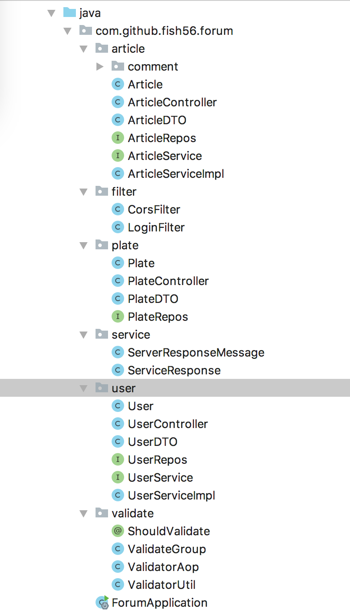

首先呢，我们来写我们的用户模块。

因为后续的几个模块都依赖了用户信息，所以这一步我会写的很详细。大家不要觉得啰嗦还，后面几个模块就会写的比较快。

这一步我会谁的很详细，

首先和一般的web应用一样我们封为

- 数据访问层

- 业务逻辑层
- web层

但是我们的这个项目功能模块划分的比较清楚，所以我们安札功能模块来组织戴拿

这个就是我们最后的功能划分。

- User用户实体类

- UserRepos接口访问数据库
- UserService处理业务逻辑
- UserControler处理web服务

Article包，validate包，