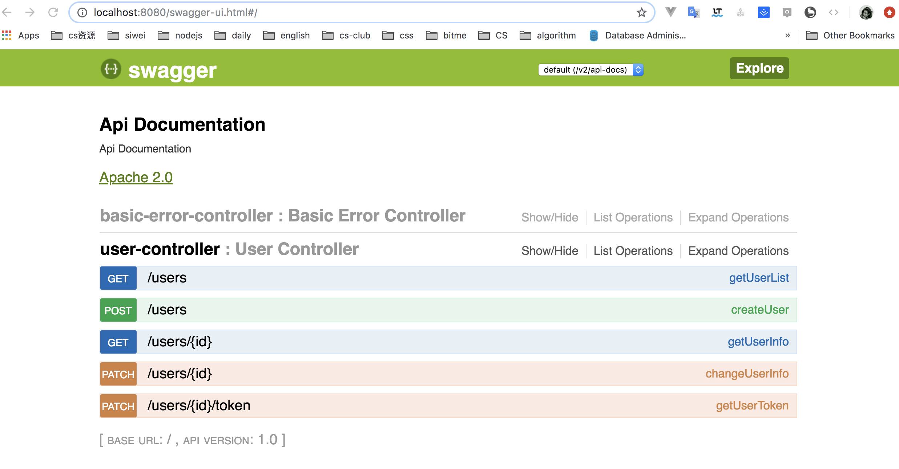

 接下来我们在写下Swagger文档，这个文档的用法我们在项目介绍中已经说过了，我们要在代码中开启Swagger文档，只要做两件事

1. 映入依赖

```xml
        <dependency>
            <groupId>io.springfox</groupId>
            <artifactId>springfox-swagger2</artifactId>
            <version>2.7.0</version>
        </dependency>
        <dependency>
            <groupId>io.springfox</groupId>
            <artifactId>springfox-swagger-ui</artifactId>
            <version>2.7.0</version>
        </dependency>
```


2. 添加@EnableSwagger2
```java
@SpringBootApplication
@EnableSwagger2
public class ForumApplication {

    public static void main(String[] args) {
        SpringApplication.run(ForumApplication.class, args);
    }

}
```

因为springfox-swagger2是专门为spring定制的，所以它可以直接解析出我们的Controller中的参数和返回值，这是大家开启项目，就可以在 http://localhost:8080/swagger-ui.html 看到我们的文档了




但是自动解析出来的文档很多描述的不够准确，我们可以通过一些注解来定制我们的文档
1. @ApiOperation("查询所有用户的信息") 这个注解就是在文档中说明我们这个API是干什么的
2. @ApiResponses({
            @ApiResponse(code = 200, message = "查询到用户列表信息",
                    response = User.class, responseContainer = "List")
    })
    

这个就是我们的返回值列表，code表示我们的而响应报文是200， 格式是User实体类的格式。
然后我们知道我们返回值可能是是个JSON数组，这里就是用List表示，
请求成功的状态吗是200，报文是一个List，也就是JSON数组，数组中的每个元素都是按照User这个实体类来的。。。

```java
    @ApiOperation("查询所有用户的信息")
    @ApiResponses({
            @ApiResponse(code = 200, message = "查询到用户列表信息",
                    response = User.class, responseContainer = "List")
    })
    @GetMapping
    public Object getUserList(){
    }

    @ApiOperation("创建一个用户")
    @ApiResponses({
            @ApiResponse(code = 201, message = "成功创建用户", response = User.class)
    })
    @PostMapping
    public ResponseEntity createUser(){
    }

    @ApiOperation("查询一个用户的信息")
    @ApiResponses({
            @ApiResponse(code = 200, message = "查询到用户信息", response = User.class)
    })
    @RequestMapping(value = "/{id}", method = RequestMethod.GET)
    public Object getUserInfo(){
    }

    @ApiOperation("修改一个用户的信息")
    @ApiResponses({
            @ApiResponse(code = 200, message = "修改了用户信息", response = User.class)
    })
    @RequestMapping(value = "/{id}", method = RequestMethod.PATCH)
    public Object changeUserInfo(@PathVariable Integer id,
                                 @Validated(ValidateGroup.OnUpdate.class)
                                 @RequestBody UserDTO userDTO,
                                 BindingResult bindingResult,
                                 @ApiIgnore @RequestAttribute User user){
    }

    @ApiOperation("更新一个用户的token")
    @ApiResponses({
            @ApiResponse(code = 200, message = "修改了用户token", response = Map.class)
    })
    @RequestMapping(value = "/{id}/token", method = RequestMethod.PATCH)
    public Object getUserToken(){
    }
```

按照同样的道理，我们写出了上述的Swagger文档。
套路都是一样的，唯一注意的是多一个一个@ApiJgnore这个注解，这个主要是我们的User是服务器自己通过token解析出来的，不是用户直接上传的，我已我们通过这个注解告知Swagger忽略这个参数