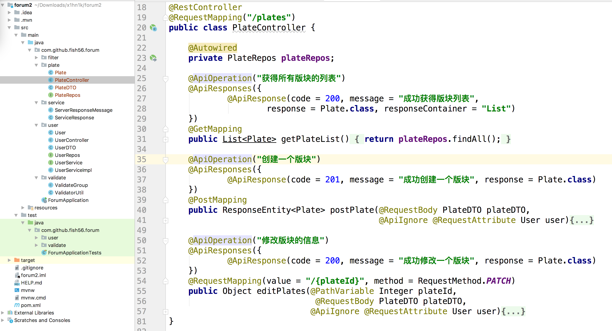
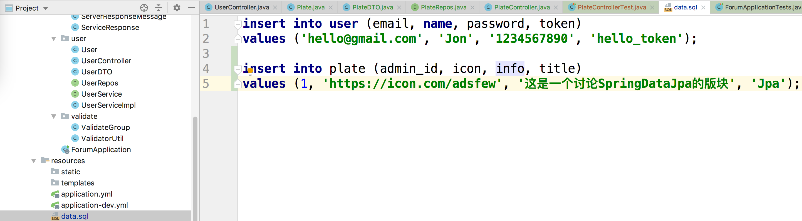
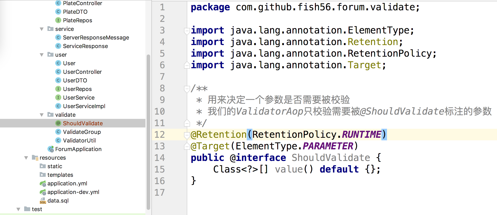
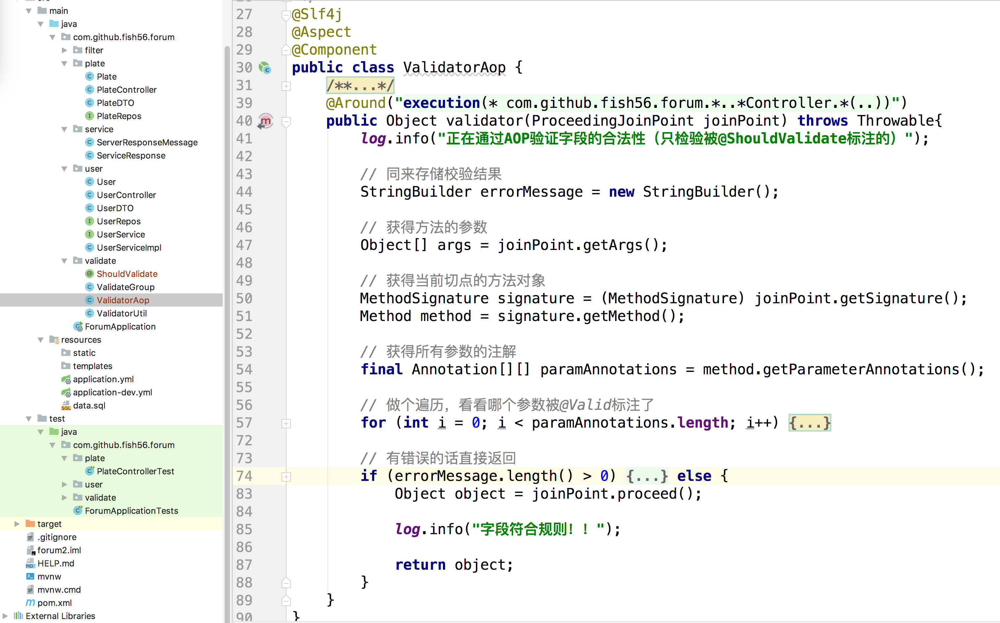
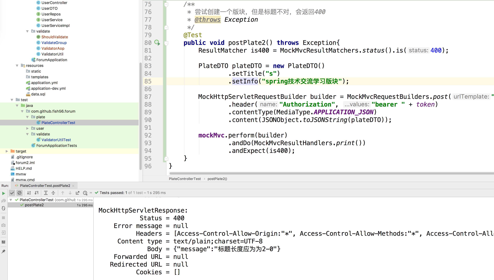

其实我们在User这个模块以及把所有的知识点都说到了，接下来重复的知识点就会说的比较快


我们这个是一个基于版块的博客论坛系统，所有文章都归属与特定的版块
所以记下来我们写我们的版块模块

首先新建一个包，plate，放置在这里


基本的实体

```java
package com.github.fish56.forum.plate;

import com.github.fish56.forum.user.User;
import lombok.Data;
import lombok.experimental.Accessors;

import javax.persistence.*;
import javax.validation.constraints.NotNull;
import javax.validation.constraints.Size;

/**
 * 版块实体
 *   - 所有的文章都存在于特定的版块
 *   - 每个版块都以一个创建者作为管理员
 *   - 管理员可以修改一个文章的便签，但是不能修改文章的内容
 */
@Entity
@Data
@Accessors(chain = true)
public class Plate {
    @Id
    @GeneratedValue(strategy = GenerationType.IDENTITY)
    private Integer id;

    @NotNull
    @Size(min=2, max=20, message = "标题长度应为为2-20")
    @Column(nullable = false, length = 50)
    private String title;

    /**
     * 版块详情介绍
     */
    private String info;

    /**
     * 版块小图标的链接
     */
    private String icon;

    /**
     * 版块的管理员，默认是创建者
     */
    @OneToOne
    private User admin;

    public void updateByDTO(PlateDTO plateDTO){
        if (plateDTO.getTitle() != null) {
            title = plateDTO.getTitle();
        }
        if (plateDTO.getInfo() != null){
            info = plateDTO.getInfo();
        }
        if (plateDTO.getIcon() != null){
            icon = plateDTO.getIcon();
        }
    }
}

```


我们的DTO

```java
/**
 * 封装用户上传的数据
 * 创建数据和修改数据用到的API不一样。。
 */
@Data
@Accessors(chain = true)
public class PlateDTO {

    @NotNull(groups = ValidateGroup.OnCreate.class, message = "创建Plate的时候必须设置title")
    @Size(min=2, max=20, message = "标题长度应为为2-20")
    @Column(nullable = false, length = 50)
    private String title;

    /**
     * 版块详情介绍
     */
    private String info;

    /**
     * 版块小图标的链接
     */
    private String icon;

}
```


这里就直接贴上代码了，没什么特别的地方也是Plate和PlateDTO，然后加上了我们的参数校验。

repos

```java
import org.springframework.data.jpa.repository.JpaRepository;

public interface PlateRepos extends JpaRepository<Plate, Integer> {
}
```
这是我们的接口层

然后因为这里的而业务逻辑比较简单，我们就要直接忽略了我们的Service，直接在COntroller层代用我们的Repos方法

```java
@Slf4j
@RestController
@RequestMapping("/plates")
public class PlateController {

    @Autowired
    private PlateRepos plateRepos;

    @ApiOperation("获得所有版块的列表")
    @ApiResponses({
            @ApiResponse(code = 200, message = "成功获得版块列表",
                    response = Plate.class, responseContainer = "List")
    })
    @GetMapping
    public List<Plate> getPlateList(){
        return plateRepos.findAll();
    }

    @ApiOperation("创建一个版块")
    @ApiResponses({
            @ApiResponse(code = 201, message = "成功创建一个版块", response = Plate.class)
    })
    @PostMapping
    public ResponseEntity<Plate> postPlate(@RequestBody PlateDTO plateDTO,
                                           @ApiIgnore @RequestAttribute User user){

        Plate plate = new Plate();
        plate.updateByDTO(plateDTO);
        plate.setAdmin(user);
        plateRepos.save(plate);
        return ResponseEntity.status(201).body(plate);
    }

    @ApiOperation("修改版块的信息")
    @ApiResponses({
            @ApiResponse(code = 200, message = "成功修改一个版块", response = Plate.class)
    })
    @RequestMapping(value = "/{plateId}", method = RequestMethod.PATCH)
    public Object editPlates(@PathVariable Integer plateId,
                              @RequestBody PlateDTO plateDTO,
                             @ApiIgnore @RequestAttribute User user){
        log.info("用户" + user.getId() + "正在尝试修改版块" + plateId + "的信息");

        // 查询目标版块的信息
        Optional<Plate> optionalPlate = plateRepos.findById(plateId);

        // 说明数据库中没有对应ID的数据
        if (!optionalPlate.isPresent()){
            return ServerResponseMessage.get(404, "目标版块不存在");
        }

        // 这个是数据库中这个版块的信息
        Plate plate = optionalPlate.get();

        // 判断当前用户是否是版块管理员
        if (!plate.getAdmin().getId().equals(user.getId())){
            return ServerResponseMessage.get(401, "只有版块管理员可以修改版块信息");
        }

        // 将记录插入数据库中
        // 标题默认无法修改
        plate.updateByDTO(plateDTO);
        return plateRepos.save(plate);
    }
}
```



和我们的User模块基本一样


接下来我们来编写我们的单元测试



```java
public class PlateControllerTest extends ForumApplicationTests {


    @Test
    public void getPlateList() throws Exception{
        ResultMatcher isOk = MockMvcResultMatchers.status().is(200);

        MockHttpServletRequestBuilder builder = MockMvcRequestBuilders.get("/plates")
                .header("Authorization", "bearer " + token);

        mockMvc.perform(builder)
                .andDo(MockMvcResultHandlers.print())
                .andExpect(isOk);
    }

    /**
     * 尝试创建一个版块
     * @throws Exception
     */
    @Test
    public void postPlate() throws Exception{
        ResultMatcher is201 = MockMvcResultMatchers.status().is(201);
        ResultMatcher hasId = MockMvcResultMatchers.jsonPath("$.id").exists();

        PlateDTO plateDTO = new PlateDTO()
                .setTitle("spring")
                .setInfo("spring技术交流学习版块");

        MockHttpServletRequestBuilder builder = MockMvcRequestBuilders.post("/plates")
                .header("Authorization", "bearer " + token)
                .contentType(MediaType.APPLICATION_JSON)
                .content(JSONObject.toJSONString(plateDTO));

        mockMvc.perform(builder)
                .andDo(MockMvcResultHandlers.print())
                .andExpect(is201)
                .andExpect(hasId);
    }

    /**
     * 尝试修改id为1的版块的内容
     * @throws Exception
     */
    @Test
    public void editPlates() throws Exception{
        ResultMatcher is200 = MockMvcResultMatchers.status().is(200);
        PlateDTO plate = new PlateDTO()
                .setTitle("spring")
                .setInfo("spring吹逼灌水论坛");

        MockHttpServletRequestBuilder builder = MockMvcRequestBuilders.patch("/plates/1")
                .header("Authorization", "bearer " + token)
                .contentType(MediaType.APPLICATION_JSON)
                .content(JSONObject.toJSONString(plate));

        mockMvc.perform(builder)
                .andDo(MockMvcResultHandlers.print())
                .andExpect(is200);
    }
}
```


不过这里有了一个一问题，我们还是需要对用户传递的参数进行校验，那怎么写呢？
要不要向之前的User模块一样写一个@Validate注解，用一个BindResult来接受？可以是可以，但是有两个问题
1. 侵入式太强了，一定要有个BindResult来接受可能存在的错误
2. 大量的样板代码，显示判断BinfResult有没有错误，然后还要错误信息转化为字符串传递给用户，

那如何解决这个问题呢？就是我们的AOP切面编程。

因为我们要拿到运行时的参数，这一点我们的过滤器和拦截器都没有办法做到


我们知道，参数校验就是对传入我们Controller层的参数进行校验，我们要是想校验，可以怎么做？

1. 可以通过一个环绕通知，拦截Controller函数的调用，
2. 拿到方法的参数，判断参数是否需要校验
3. 使用我们之前写的ValidateUtil对参数进行校验

之前我们都是用@Validate这个租借来开启校验的，现在我们希望开启自定义检验，那肯要自己写一个注解



```java
/**
 * 用来决定一个参数是否需要被校验
 * 我们的ValidatorAop只校验需要被@ShouldValidate标注的参数
 */
@Retention(RetentionPolicy.RUNTIME)
@Target(ElementType.PARAMETER)
public @interface ShouldValidate {
    Class<?>[] value() default {};
}
```
我们约定，我们的自定义检验规则只检验那些被@ShouldValidate标注的
然后我们自定义注解也支持分组检验，用户可以写形如@ShouldValidate(ValidateGroup.OnUpdate.class)格式来进行封住检验

那么重点是：如何编写我们的AOP切面？

我先把代码贴出来，然后慢慢解释

```java
@Slf4j
@Aspect
@Component
public class ValidatorAop {
    /**
     * 这个切面是校验Controller层参数的合法性
     *   - 匹配com.github.fish56.forum包所有的子包的中以Controller结尾的类的所有方法
     *   - 只校验被@ShouldValidate标注的参数
     * @param joinPoint
     * @return
     * @throws Throwable
     */
    @Around("execution(* com.github.fish56.forum.*..*Controller.*(..))")
    public Object validator(ProceedingJoinPoint joinPoint) throws Throwable{
        log.info("正在通过AOP验证字段的合法性（只检验被@ShouldValidate标注的）");

        // 同来存储校验结果
        StringBuilder errorMessage = new StringBuilder();

        // 获得方法的参数
        Object[] args = joinPoint.getArgs();

        // 获得当前切点的方法对象
        MethodSignature signature = (MethodSignature) joinPoint.getSignature();
        Method method = signature.getMethod();

        // 获得所有参数的注解 因为方法中可能有多个参数，每个参数可能被多个注解标注，所以这里我们拿到的是一个二维数组
        final Annotation[][] paramAnnotations = method.getParameterAnnotations();

        // 做个遍历，看看哪个参数被@ShouldValidate标注了
        for (int i = 0; i < paramAnnotations.length; i++) {
            for (Annotation a: paramAnnotations[i]) {

                // 判断当前参数是不是被ShouldValidate标注了
                if (a instanceof ShouldValidate) {
                    log.info("参数" + i + "被 @ShouldValidate注解了");

                    // 检查它的合法性，如果有错误信息，就将它输送给errorMessage
                    // 如果当前注解是ShouldValidate的实例，那么我们就要开启校验
                    // ((ShouldValidate) a).value()就是难道相关的
                    String error = ValidatorUtil.validate(args[i], ((ShouldValidate) a).value());
                    if (error != null) {
                        errorMessage.append(error);
                    }
                }
            }
        }

        // 有错误的话直接返回
        if (errorMessage.length() > 0) {
            log.warn("字段不符合规则，已经打回去重写了！");

            // 删除最后面的 ", "
            errorMessage.delete(errorMessage.length() - 2, errorMessage.length() - 1);

            return ServerResponseMessage.get(400, errorMessage.toString());

        } else {
            Object object = joinPoint.proceed();

            log.info("字段符合规则！！");

            return object;
        }
    }
}
```

1. @Aspect来定义我们的切面类，@Component把它注入到我们的IOC容器
2. @Around("")表明这个会个环绕通知
3. execution(* com.github.fish56.forum.*..*Controller.*(..))匹配的是我们的com.github.fish56.forum先的所有子包中，以Controler结尾的类的任意方法，这样没错吧
4. ProceedingJoinPoint joinPoint就是我们的切点


这个是代码的基本信息

然后的额内容就是
1. Object[] args = joinPoint.getArgs(); 拿到我们的切点方法的所有参数




接下来我们就来试一试我们的切面类是否工作
我们仅仅是使用@ShouldValidate(ValidateGroup.OnCreate.class)，没有其他的样板代码了，

```java
    @ApiOperation("创建一个版块")
    @ApiResponses({
            @ApiResponse(code = 201, message = "成功创建一个版块", response = Plate.class)
    })
    @PostMapping
    public ResponseEntity<Plate> postPlate(@ShouldValidate(ValidateGroup.OnCreate.class) @RequestBody PlateDTO plateDTO,
                                           @ApiIgnore @RequestAttribute User user){

        ...
    }

    @ApiOperation("修改版块的信息")
    @ApiResponses({
            @ApiResponse(code = 200, message = "成功修改一个版块", response = Plate.class)
    })
    @RequestMapping(value = "/{plateId}", method = RequestMethod.PATCH)
    public Object editPlates(@PathVariable Integer plateId,
                             @ShouldValidate(ValidateGroup.OnUpdate.class)
                             @RequestBody PlateDTO plateDTO,
                             @ApiIgnore @RequestAttribute User user){
        ...
    }
```

然后我们编写一个测试文件，这次的测试文件提交的title长度跳段，不符合校验规则，我们看看是否共工作

```java
    /**
     * 尝试创建一个版块，但是标题不对，会返回400
     * @throws Exception
     */
    @Test
    public void postPlate2() throws Exception{
        ResultMatcher is400 = MockMvcResultMatchers.status().is(400);

        PlateDTO plateDTO = new PlateDTO()
                .setTitle("s")
                .setInfo("spring技术交流学习版块");

        MockHttpServletRequestBuilder builder = MockMvcRequestBuilders.post("/plates")
                .header("Authorization", "bearer " + token)
                .contentType(MediaType.APPLICATION_JSON)
                .content(JSONObject.toJSONString(plateDTO));

        mockMvc.perform(builder)
                .andDo(MockMvcResultHandlers.print())
                .andExpect(is400);
    }
```



重结果汇总可以看到，确实成功了。