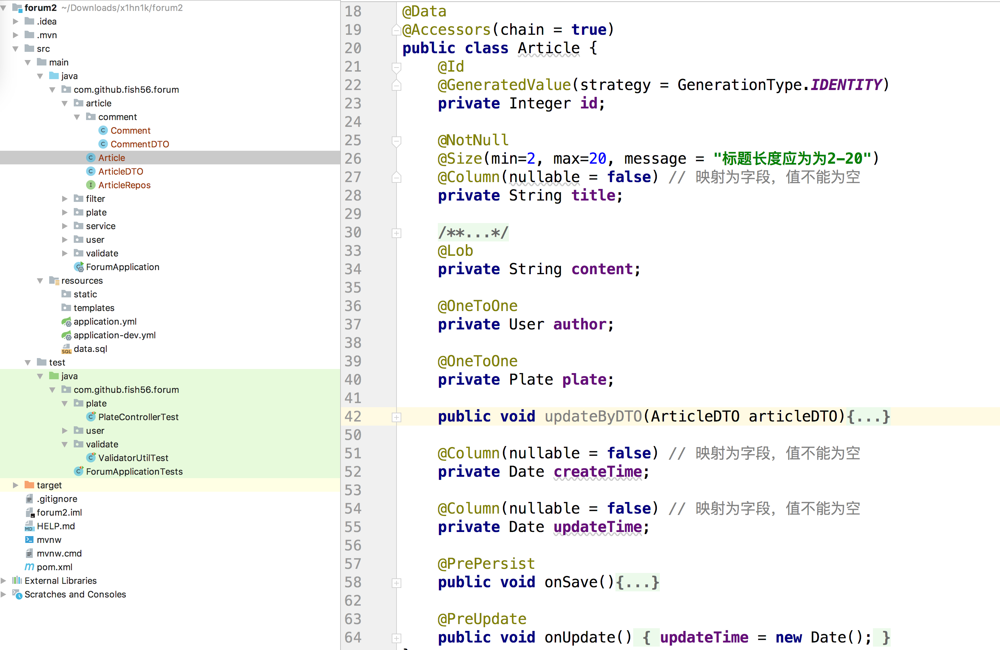
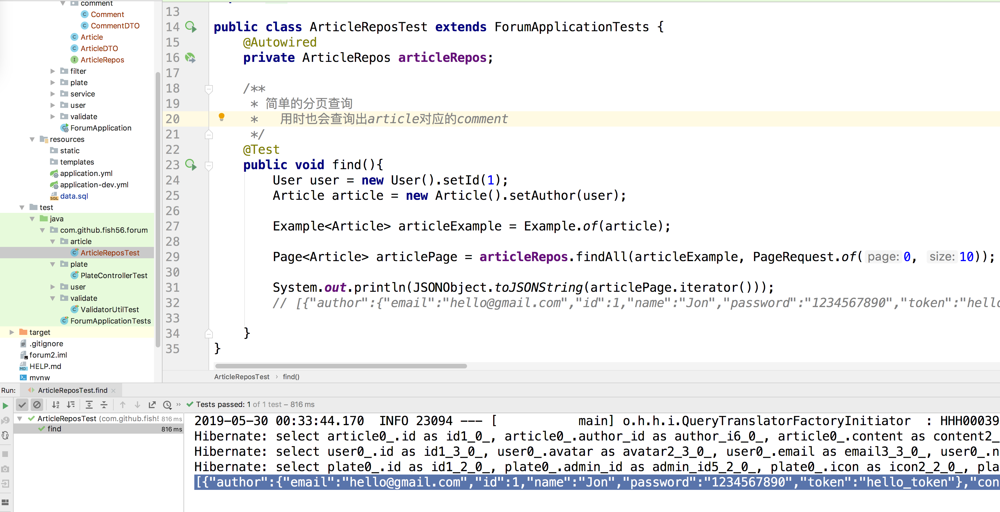

接下来编写我们的文章模块。这部分主要是说实体之间的关系，以及分页查询。

首先我们看一下我们的文章实体的基本信息
```java
/**
 * 文章实体
 */
@Entity
@Data
@Accessors(chain = true)
public class Article {
    @Id
    @GeneratedValue(strategy = GenerationType.IDENTITY)
    private Integer id;

    @NotNull
    @Size(min=2, max=20, message = "标题长度应为为2-20")
    @Column(nullable = false) // 映射为字段，值不能为空
    private String title;

    /**
     * mysql中的大数据类型
     */
    @Lob
    private String content;

    @OneToOne
    private User author;

    @OneToOne
    private Plate plate;


    public void updateByDTO(ArticleDTO articleDTO){
        if (articleDTO.getTitle() != null){
            this.title = articleDTO.getTitle();
        }
        if (articleDTO.getContent() != null){
            this.content = articleDTO.getContent();
        }
    }

    @Column(nullable = false) // 映射为字段，值不能为空
    private Date createTime;

    @Column(nullable = false) // 映射为字段，值不能为空
    private Date updateTime;
}
```

基本情况就是看代码说话，唯一不同的就是我们的文章实体一般都会有一个创建时间和修改时间的字段，来作为文章的基本信息，如上图所示。但是在数据库的建表语句中，我们的会用
currnetTime on update curre  来让数据库自动的管理这两个时间。但是在Jpa中我们如何设置呢？
其实我们可以这样写：

```java
    @PrePersist
    public void onSave(){
        createTime = new Date();
        updateTime = new Date();
    }

    @PreUpdate
    public void onUpdate(){
        updateTime = new Date();
    }
```
这连个注解是jpa提供的两个构造，底层在创建insert语句之前，会执行下@PrePersist标注的方法，在创建update语句的时候会执行@PReUpdate方法，通过上面两个钩子函数，我们的可以让JPa帮我们管理这两个字段了，不用我们手动的维护


下面这个是常见的DTO
```java
@Data
@Accessors(chain = true)
public class ArticleDTO {
    @NotNull(groups = ValidateGroup.OnCreate.class, message = "创建Article的时候必须设置title")
    @ApiModelProperty("文章的标题")
    @Size(min=2, max=20, message = "标题长度应为为2-20")
    private String title;

    @ApiModelProperty("文章的内容")
    private String content;
}
```


记下来编写我们的Commen实体
```java
/**
 * 评论信息
 */
@Entity
@Data
@Accessors(chain = true)
public class Comment {
    @Id
    @GeneratedValue(strategy = GenerationType.IDENTITY)
    private Integer id;

    @OneToOne
    private User author;

    private String content;

    /**
     * 如果这是一个独立的评论，那么这个值应该为null
     * 如果这是回复评论A的评论，那么它的值就是A
     */
    @OneToOne
    private Comment replyTo;

    @CreationTimestamp
    private Timestamp createTime;

    @UpdateTimestamp
    private Timestamp updateTime;

    public void updateByDTO(CommentDTO commentDTO){
        if (commentDTO.getContent()!=null){
            content = commentDTO.getContent();
        }
        if (commentDTO.getReplyToId() != null){
            replyTo = new Comment().setId(commentDTO.getReplyToId());
        }
    }
}
```

```java
/**
 * 评论信息
 */
@Data
@Accessors(chain = true)
public class CommentDTO {

    @NotEmpty(message = "评论内容不能为空")
    private String content;

    /**
     * 向第i个评论回复
     */
    private Integer replyToId;
}
```


这里唯一的不同就是
``` java
 @CreationTimestamp
    private Timestamp createTime;

    @UpdateTimestamp
    private Timestamp updateTime;
```
这样是在另一种写法，也可以实现自动更新


接下来就是重点：实体之间的关系
文章和评论是典型的一对多的关系。一个文章可以有多个评论。
其实以一对多的关系可以用一对一的关系来模仿的，比如我们之前的User和Plate，一个plate对应一个user，一个user可能对应多个plate

但是把实体间用1对多的关系联系起来，可以简化我们的代码

我们Artilce类添加这段代码

```java
@OneToMany(fetch = FetchType.EAGER, cascade = CascadeType.ALL)
    @JoinColumn(name = "comment_id")
    private List<Comment> comments;
```


- fetch = FetchType.EAGER就是说我们在查询Article的时候，也会把相关的comments给顺带查询出来查询来
- https://blog.csdn.net/u011726984/article/details/72625783
- 改了Articl的comments，也会修改数据库的Comments
- JoniClone连接点，怎么查找呢?就是通过这个键来查找，猜出来column的
- 

https://www.cnblogs.com/rulian/p/6533109.html


Comnent上比较简单

```java
@ManyToOne
    private Article article;
```





```java
public interface ArticleRepos extends JpaRepository<Article, Integer> {
}
```


为了方便我们的
```sql
insert into article (author_id, content, plate_id, title, create_time, update_time)
values ( 1, 'hello world', 1, 'Spring天下无敌', current_timestamp(), current_timestamp());

insert into comment (content, author_id, article_id, reply_to_id)
values ('这是一个评论', 1, 1, null)
```

上面我们基本就写出了实体之间的对应管理了

接下来我们来看下分页查询，之前的几个场景都比较简单，就没有用到分页查询，这里我就来了一个。

条件查询，findByEanmp

和MyBaits中的findBySelect比较像。


```java
public class ArticleReposTest extends ForumApplicationTests {
    @Autowired
    private ArticleRepos articleRepos;

    /**
     * 简单的分页查询
     *   用时也会查询出article对应的comment
     */
    @Test
    public void find(){
        User user = new User().setId(1);
        Article article = new Article().setAuthor(user);

        Example<Article> articleExample = Example.of(article);

        Page<Article> articlePage = articleRepos.findAll(articleExample, PageRequest.of(0, 10));

        System.out.println(JSONObject.toJSONString(articlePage.iterator()));

    }
}
```
查询所有用户id为1的文章，同时做出分页处理


既有简单用法，又有




然后我们的ArticleService

```java
@Service
public interface ArticleService {
    public ServiceResponse findById(Integer id);

    /**
     * 条件查询文章列表，并做分页处理
     * @param articleExample
     * @param page
     * @return
     */
    public ServiceResponse<Article> findAll(Example<Article> articleExample, Pageable page);
    public ServiceResponse<Article> create(Integer plateId, Article article);
    public ServiceResponse<Article> updateByVo(Integer articleId, ArticleDTO articleDTO);
}
```


```java
@Slf4j
@Service
public class ArticleServiceImpl implements ArticleService {
    @Autowired
    private PlateRepos plateRepos;
    @Autowired
    private ArticleRepos articleRepos;

    @Override
    public ServiceResponse findAll(Example<Article> articleExample, Pageable page) {
        Page<Article> articlePage = articleRepos.findAll(articleExample, page);
        return ServiceResponse.getInstance(articlePage.iterator());
    }

    @Override
    public ServiceResponse findById(Integer id) {
        log.info("正在查询文章" + id);
        Optional<Article> optionalArticle = articleRepos.findById(id);
        if (!optionalArticle.isPresent()) {
            log.info("查询的文章不存在");
            return ServiceResponse.getInstance(404, "当前文章不存在");
        } else {
            log.info("查询到文章: " + optionalArticle.get().toString());
            return ServiceResponse.getInstance(optionalArticle.get());
        }
    }

    /**
     * 假如创建文章时，传入的article中存在id字段，该如何处理？
     *   - 报错：提醒前端不应该传入id
     *   - 忽略
     *   - 按照传入的id来创建（这就给前端比较大的权限了）
     *
     *   没有固定的处理方式，这里我选择忽略这个字段
     * @param article
     * @return
     */
    @Override
    public ServiceResponse create(Integer plateId, Article article) {
        Optional<Plate> plateOptional = plateRepos.findById(plateId);
        if (!plateOptional.isPresent()){
            return ServiceResponse.getInstance(404, "版块" + plateId + "不存在");
        }
        article.setPlate(plateOptional.get());
        article.setId(null);

        log.info("正在将文章信息插入数据库: " + article.toString());
        articleRepos.save(article);
        return ServiceResponse.getInstance(article);
    }

    @Override
    public ServiceResponse updateByVo(Integer articleId, ArticleDTO articleDTO) {
        log.info("正在更新文章信息");
        Optional<Article> optionalArticle = articleRepos.findById(articleId);

        if (!optionalArticle.isPresent()) {
            log.info("试图更新的文章不存在");
            return ServiceResponse.getInstance(404, "试图更新的文章不存在");
        }

        Article article = optionalArticle.get();
        article.updateByDTO(articleDTO);
        articleRepos.save(article);
        return ServiceResponse.getInstance(article);
    }
}
```

最后一个，完结了。
```java
@Slf4j
public class ArticleServiceImplTest extends ForumApplicationTests {
    @Autowired
    private ArticleService articleService;

    /**
     * 用过id来查询一个文章
     */
    @Test
    public void findById(){
        ServiceResponse<Article> response = articleService.findById(1);
        System.out.println(JSONObject.toJSONString(response.getData()));
        assertTrue( response.getData().getId() == 1);
    }

    /**
     * 创建一个文章
     */
    @Test
    public void create() {
        Article article = new Article()
                .setTitle("好好好").setContent("sdf")
                .setAuthor(new User().setId(1));

        ServiceResponse<Article> response = articleService.create(1, article);
        log.info(response.getData().toString());
        // 因为数据库目前只有一个记录，所以插入新的数据的id一定是2
        assertTrue(response.getData().getId().equals(2));
    }

    @Test
    public void update(){
        String newTitle = "titlllllle";
        ArticleDTO articleDTO = new ArticleDTO().setTitle("titlllllle");

        ServiceResponse<Article> serviceResponse = articleService.updateByVo(1, articleDTO);

        log.info(serviceResponse.getData().toString());

        // 确保正确的修改了title
        assertEquals(newTitle, serviceResponse.getData().getTitle());

        // 新的article的content的字段为null，所以这个字段应该忽略，而不是将原来的值设置为null
        assertNotNull(serviceResponse.getData().getContent());
    }

    @Test
    public void findAll() {


        Plate plate = new Plate().setId(1);
        Article article = new Article().setPlate(plate);

        Example<Article> articleExample = Example.of(article);

        System.out.println(JSONObject.toJSONString(
                articleService.findAll(articleExample, PageRequest.of(0, 30)).getData()));

    }
}

```

```java
@Slf4j
@RestController
@RequestMapping("/articles")
public class ArticleController {
    @Autowired
    private ArticleService articleService;

    @ApiOperation("获得所有用户列表")
    @ApiResponses({
            @ApiResponse(code = 200, message = "查询文章列表", response = Article.class, responseContainer = "List")
    })
    @GetMapping
    public Object getArticles(@RequestParam(required = false) Integer plateId,
                              @RequestParam(required = false) Integer authorId,
                              @RequestParam(required = false, defaultValue = "0") Integer page,
                              @RequestParam(required = false, defaultValue = "30") Integer size){
        Article article = new Article();
        if (plateId != null) {
            Plate plate = new Plate().setId(plateId);
            article.setPlate(plate);
        }
        if (authorId != null){
            User user = new User().setId(authorId);
            article.setAuthor(user);
        }
        log.info("用户传递的参数为: " + article.toString());
        Example<Article> articleExample = Example.of(article);

        ServiceResponse serviceResponse =  articleService.findAll(articleExample, PageRequest.of(page, size));
        if (serviceResponse.hasError()){
            return serviceResponse.getErrorResponseEntity();
        } else {
            return serviceResponse.getSuccessResponseEntity();
        }
    }
```


18 元把

